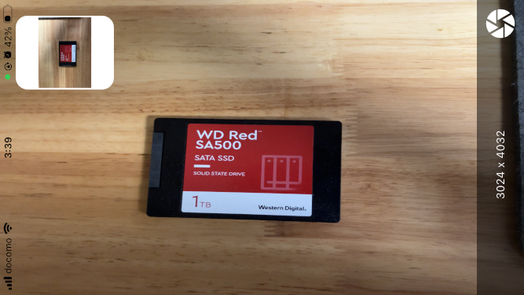
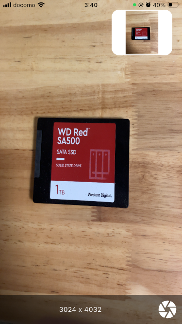
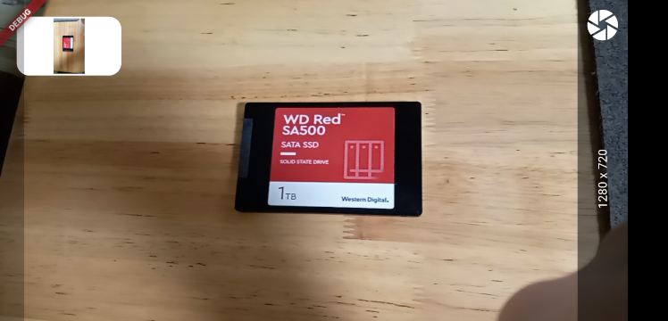
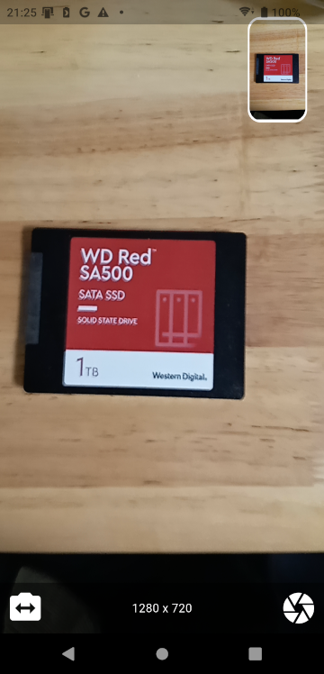

# Bake Camera Exif

## Abstracts

* How to bake exif orientation property from camera image

## Dependencies

* [camera](https://github.com/flutter/packages/tree/main/packages/camera/camera)
  * 0.10.6
  * BSD-3-Clause license
* [image](https://github.com/brendan-duncan/image)
  * 4.7.1
  * MIT license
* [native_device_orientation](https://github.com/rmtmckenzie/flutter_native_device_orientation)
  * 2.1.0
  * MIT license

## Screenshots

#### iOS

|Rotate|Image|
|---|---|
|Landscape Left||
|Portrait Up||

#### Android

|Rotate|Image|
|---|---|
|Landscape Left||
|Portrait Up||
