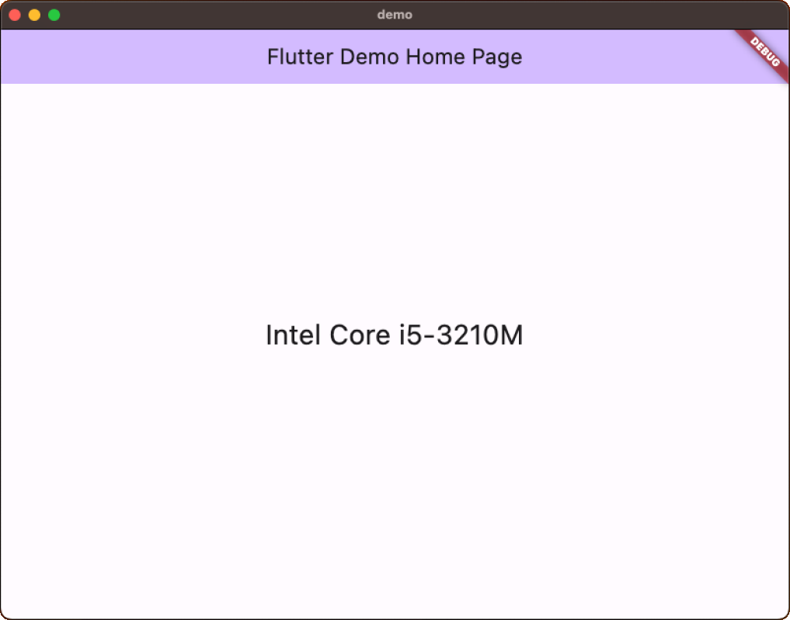

# Get Packages

## Abstracts

* Get cpu packages

## Requirements

### Common

* Powershell 7 or later
* CMake 3.5.0 or later
* C++ Compiler supports C++14

### Windows

* Visual Studio 2022

### Linux

* g++

### OSX

* Xcode 14.1 or later

### iOS

#### Xcode

* Xcode 14.1 or later

#### Flutter

* Flutter 3.10.6 or later

### Android

* N/A

## Dependencies

* [cpuinfo](https://github.com/pytorch/cpuinfo)
  * d7069b3919d1b65da5e8e333cb5817570a30b49a
  * BSD 2-Clause "Simplified" License

## How to use?

You shall build `cpuinfo` before test it.

### Console

````bat
$ pwsh build.ps1 <win/linux/osx> <x86_64/arm64> <Release/Debug>
[info] name: Intel Core i7-8700
````

### Desktop

|Flutter|
|---|
||

### Mobile

#### iOS Simulator

````sh
$ pwsh build.ps1 iphonesimulator <x86_64/arm64> <Release/Debug> "platform=iOS Simulator,name=iPhone 14 Pro,OS=16.1"
````

|Xamarin|MAUI|Xcode|Flutter|
|---|---|---|---|
|||||

#### Android Simulator

|Xamarin|MAUI|
|---|---|
|||