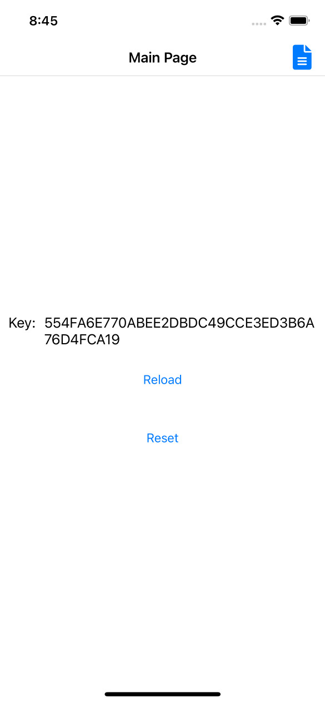
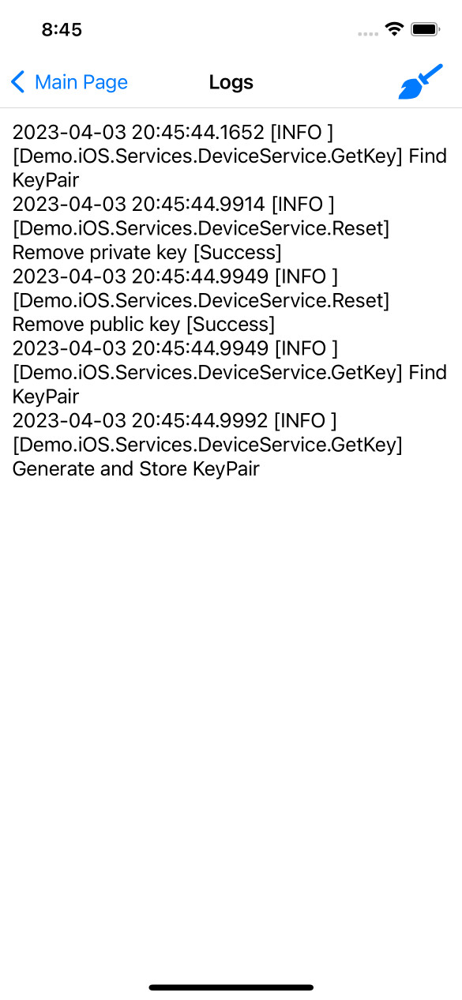
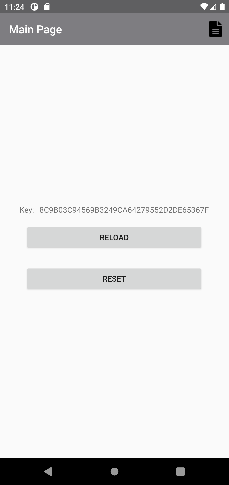
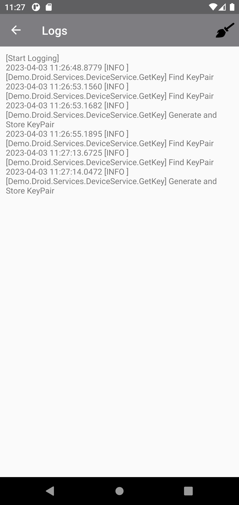

# Generate Pseudo DeviceId

## Abstracts

* For iOS and Android, generated unique id from key pair
  * Key pair is stored in security vault in device and it is cleared if application is uninstalled. Therefore, unique id is not change untill uninstall.

## Requirements

* Visual Studio 2022
* Xamarin

## Dependencies

* [Font Awesome Free](https://fontawesome.com/)
  * Fonts
    * SIL Open Font License
* [NLog](https://github.com/NLog/NLog)
  * BSD-3-Clause License
* [Prism.Unity.Forms](https://github.com/PrismLibrary/Prism)
  * MIT License
* [Xamarin.Essentials.Interfaces](https://github.com/rdavisau/essential-interfaces)
  * MIT License
* [Xamarin.Forms](https://github.com/xamarin/Xamarin.Forms)
  * MIT License

## How to usage?

### iOS

 

### Android

 