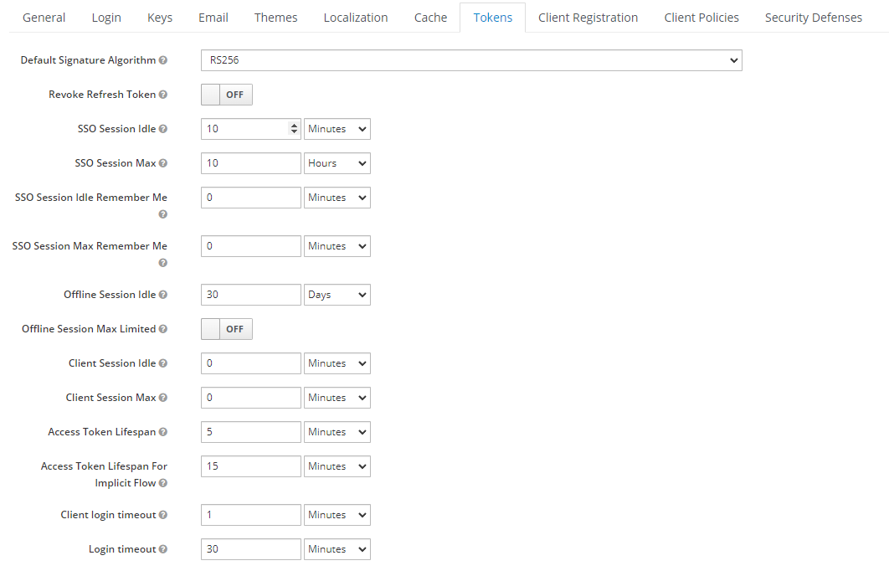

# Refresh Token Demo in Xamarin

## Abstracts

* Check expiration of access token and update access token by refresh token
* User need not to login if refresh token is available on next login

## Requirements

* Visual Studio 2022
* Xamarin
* iPhone Simulator
  * Target OS 13.0 or later

## Dependencies

* [Font Awesome Free](https://fontawesome.com/)
  * Fonts
    * SIL Open Font License
* [NLog](https://github.com/NLog/NLog)
  * BSD-3-Clause License
* [Prism.Unity.Forms](https://github.com/PrismLibrary/Prism)
  * MIT License
* [Xamarin.Essentials.Interfaces](https://github.com/rdavisau/essential-interfaces)
  * MIT License
* [Xamarin.Forms](https://github.com/xamarin/Xamarin.Forms)
  * MIT License

## Preparation

Basically, default value of `Access Token Lifespan` is a bit long. so change value for this demo on Keycloak .



And you must update this code.

````csharp
        public LoginService(IStorageService storageService,
                            ILoggingService loggingService)
        {
            this._StorageService = storageService;
            this._LoggingService = loggingService;

            var browser = DependencyService.Get<IBrowser>();
            var options = new OidcClientOptions
            {
                Authority = "http://192.168.11.21:8080/realms/dotnet-sample",
                ClientId = "console-pkce",
                Scope = "openid",
                RedirectUri = "xamarinformsclients://callback",
                PostLogoutRedirectUri = "xamarinformsclients://callback",
                Browser = browser,
                Policy = new Policy
                {
                    Discovery = new DiscoveryPolicy
                    {
                        RequireHttps = false
                    }
                }
            };

            this._Client = new OidcClient(options);
            this._ApiClient.Value.BaseAddress = new Uri("http://192.168.11.21:8080/");
        }
````

## Result

### Android

  

### iOS

 
