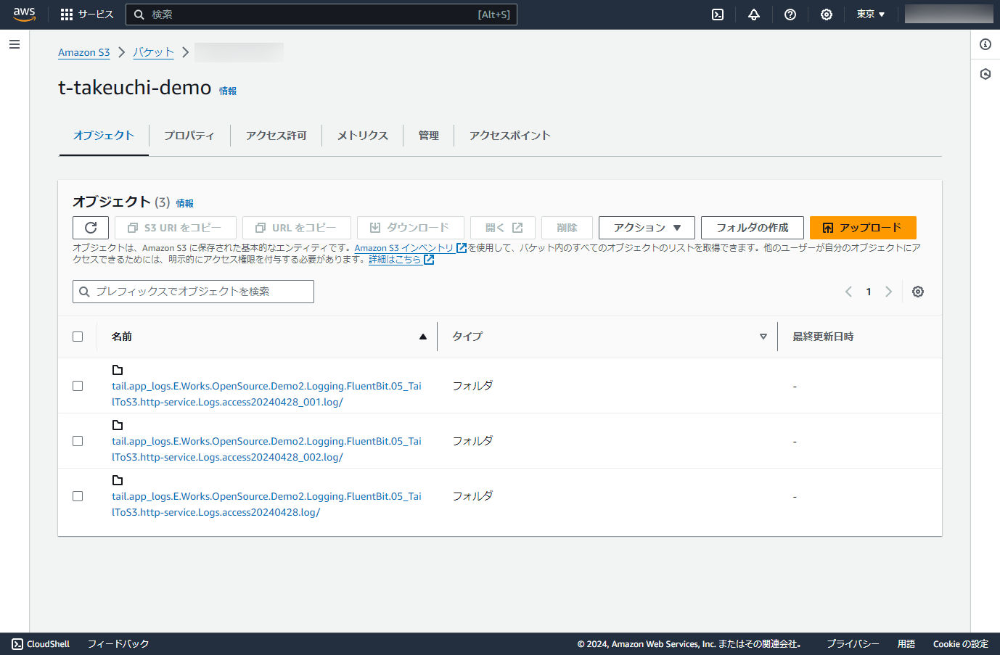

# Input application log files and Output to Amazon S3

## Abstracts

* Input application log files and output it to Amazon S3
  * Use input `tail` and output `s3` plugins
  * Application log files are normal text logs. `tail` plugin observe them and fluent-bit forward them to output plugin
  * This approach should not modify application side

## Requirements

* Powershell 7 or later
* .NET 6.0 SDK

## Dependencies

* [FluentBit](https://fluentbit.io/)
  * 3.0.2
  * Apache License 2.0

## Configuration

Here is configuration of input and output plugins.

#### INPUT

|Key|Value|
|---|---|
|name|tail|
|tag|tail.app_logs.*|
|path|${PROJECT_ROOT}\http-service\Logs\access*.log|
|path_key|application_log_file_path|
|read_from_head|true|
|refresh_interval|30|

##### Important

You SHALL use `\` as path delimiter for `path` on Windows.

#### OUTPUT

|Key|Value|
|---|---|
|name|s3|
|match|*|
|region|${S3_REGION}|
|bucket|${S3_BUCKET_NAME}|
|total_file_size|10M|
|upload_timeout|1m|
|use_put_object|On|
|compression|gzip|
|s3_key_format_tag_delimiters|-|
|s3_key_format|/$TAG/%Y/%m/%d/%H/%M/%S/$UUID.gz|

## How to run?

Af first, you must download or install fluentbit.
Please refer [README.md](../00_GetStarted/README.md).

Then, launch sample http application.

````shell
$ cd http-service
$ dotnet run -c Release --urls http://localhost:5001
ビルドしています...
2024-04-28T19:42:40.1115198+09:00 [INF] [] [] Starting web application
````

Next, set aws access key id and secret access key.
Please refer [AWS Credentials](https://github.com/fluent/fluent-bit-docs/blob/master/administration/aws-credentials.md).

````bat
set AWS_ACCESS_KEY_ID=XXXXXXXXXXXXXXXXXXXX
set AWS_SECRET_ACCESS_KEY=XXXXXXXXXXXXXXXXXXXXXXXXXXXXXXXXXXXXXXXX
````

or 

````bat
set AWS_SHARED_CREDENTIALS_FILE=C:\Users\xxxxx\.aws\credentials
````

Lastly, kick `Run.ps1` with bucket name and region.

````bat
$ pwsh Run.ps1 <your_bucketname> <s3_region>
Creating output directory for fluentbit plugins
Starting fluentbit...
Fluent Bit v3.0.2
* Copyright (C) 2015-2024 The Fluent Bit Authors
* Fluent Bit is a CNCF sub-project under the umbrella of Fluentd
* https://fluentbit.io

___________.__                        __    __________.__  __          ________
\_   _____/|  |  __ __   ____   _____/  |_  \______   \__|/  |_  ___  _\_____  \
 |    __)  |  | |  |  \_/ __ \ /    \   __\  |    |  _/  \   __\ \  \/ / _(__  <
 |     \   |  |_|  |  /\  ___/|   |  \  |    |    |   \  ||  |    \   / /       \
 \___  /   |____/____/  \___  >___|  /__|    |______  /__||__|     \_/ /______  /
     \/                     \/     \/               \/                        \/

[2024/04/29 00:10:48] [error] [D:\a\fluent-bit\fluent-bit\src\config_format\flb_cf_fluentbit.c:458 errno=2] No such file or directory
[2024/04/29 00:10:48] [error] [D:\a\fluent-bit\fluent-bit\src\config_format\flb_cf_fluentbit.c:458 errno=2] No such file or directory
[2024/04/29 00:10:48] [ info] [fluent bit] version=3.0.2, commit=33ce918351, pid=20124
[2024/04/29 00:10:48] [ info] [storage] ver=1.5.2, type=memory, sync=normal, checksum=off, max_chunks_up=128
[2024/04/29 00:10:48] [ info] [cmetrics] version=0.7.3
[2024/04/29 00:10:48] [ info] [ctraces ] version=0.4.0
[2024/04/29 00:10:48] [ info] [input:tail:tail.0] initializing
[2024/04/29 00:10:48] [ info] [input:tail:tail.0] storage_strategy='memory' (memory only)
[2024/04/29 00:10:48] [ info] [output:s3:s3.0] Using upload size 10000000 bytes
[2024/04/29 00:10:48] [ info] [output:s3:s3.0] Sending locally buffered data from previous executions to S3; buffer=/tmp/fluent-bit/s3/t-takeuchi-demo
[2024/04/29 00:10:48] [ info] [output:s3:s3.0] Pre-compression chunk size is 2118, After compression, chunk is 427 bytes
[2024/04/29 00:10:49] [ info] [output:s3:s3.0] Successfully uploaded object /tail.app_logs.E.Works.OpenSource.Demo2.Logging.FluentBit.05_TailToS3.http-service.Logs.access20240428.log/2024/04/28/15/10/48/mKQ8nMFL.gz
[2024/04/29 00:10:49] [ info] [output:s3:s3.0] Pre-compression chunk size is 2489, After compression, chunk is 431 bytes
[2024/04/29 00:10:49] [ info] [output:s3:s3.0] Successfully uploaded object /tail.app_logs.E.Works.OpenSource.Demo2.Logging.FluentBit.05_TailToS3.http-service.Logs.access20240428_001.log/2024/04/28/15/10/48/y5KN1JZ3.gz
[2024/04/29 00:10:49] [ info] [output:s3:s3.0] Pre-compression chunk size is 1789, After compression, chunk is 395 bytes
[2024/04/29 00:10:49] [ info] [output:s3:s3.0] Successfully uploaded object /tail.app_logs.E.Works.OpenSource.Demo2.Logging.FluentBit.05_TailToS3.http-service.Logs.access20240428_002.log/2024/04/28/15/10/48/N7T3XiBA.gz
[2024/04/29 00:10:49] [ info] [sp] stream processor started
[2024/04/29 00:10:49] [ info] [output:s3:s3.0] worker #0 started
[2024/04/29 00:10:53] [engine] caught signal (SIGINT)
[2024/04/29 00:10:53] [ warn] [engine] service will shutdown in max 5 seconds
[2024/04/29 00:10:53] [ info] [input] pausing tail.0
[2024/04/29 00:10:53] [engine] caught signal (SIGINT)
[2024/04/29 00:10:54] [ info] [engine] service has stopped (0 pending tasks)
[2024/04/29 00:10:54] [ info] [input] pausing tail.0
[2024/04/29 00:10:54] [ info] [output:s3:s3.0] thread worker #0 stopping...
[2024/04/29 00:10:54] [ info] [output:s3:s3.0] thread worker #0 stopped
[2024/04/29 00:10:54] [ info] [output:s3:s3.0] Sending all locally buffered data to S3
[2024/04/29 00:10:54] [ info] [output:s3:s3.0] Pre-compression chunk size is 2118, After compression, chunk is 427 bytes
[2024/04/29 00:10:54] [engine] caught signal (SIGINT)
[2024/04/29 00:10:54] [ info] [output:s3:s3.0] Successfully uploaded object /tail.app_logs.E.Works.OpenSource.Demo2.Logging.FluentBit.05_TailToS3.http-service.Logs.access20240428.log/2024/04/28/15/10/50/F1aX3G0x.gz
[2024/04/29 00:10:54] [ info] [output:s3:s3.0] Pre-compression chunk size is 2489, After compression, chunk is 434 bytes
[2024/04/29 00:10:54] [ info] [output:s3:s3.0] Successfully uploaded object /tail.app_logs.E.Works.OpenSource.Demo2.Logging.FluentBit.05_TailToS3.http-service.Logs.access20240428_001.log/2024/04/28/15/10/50/eLTKTeRc.gz
[2024/04/29 00:10:54] [ info] [output:s3:s3.0] Pre-compression chunk size is 1789, After compression, chunk is 395 bytes
[2024/04/29 00:10:54] [ info] [output:s3:s3.0] Successfully uploaded object /tail.app_logs.E.Works.OpenSource.Demo2.Logging.FluentBit.05_TailToS3.http-service.Logs.access20240428_002.log/2024/04/28/15/10/50/L9x23dTm.gz
````

### Output samples

