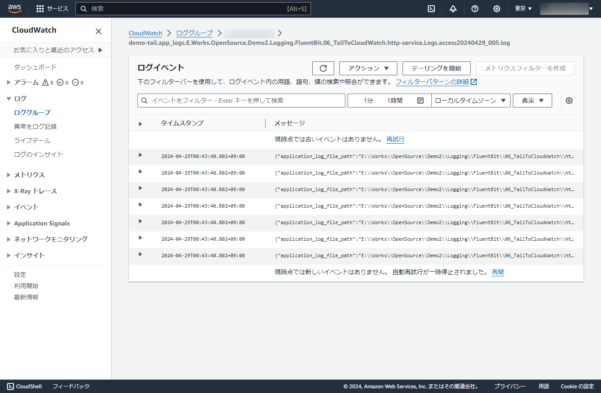

# Input application log files and Output to Amazon CloudWatch

## Abstracts

* Input application log files and output it to Amazon CloudWatch
  * Use input `tail` and output `cloudwatch_logs` plugins
  * Application log files are normal text logs. `tail` plugin observe them and fluent-bit forward them to output plugin
  * This approach should not modify application side

## Requirements

* Powershell 7 or later
* .NET 6.0 SDK

## Dependencies

* [FluentBit](https://fluentbit.io/)
  * 3.0.2
  * Apache License 2.0

## Configuration

Here is configuration of input and output plugins.

#### INPUT

|Key|Value|
|---|---|
|name|tail|
|tag|tail.app_logs.*|
|path|${PROJECT_ROOT}\http-service\Logs\access*.log|
|path_key|application_log_file_path|
|read_from_head|true|
|refresh_interval|30|

##### Important

You SHALL use `\` as path delimiter for `path` on Windows.

#### OUTPUT

|Key|Value|
|---|---|
|name|cloudwatch_logs|
|match|*||
|region|${CLOUDWATCH_REGION}|
|log_group_name|${CLOUDWATCH_GROUP_NAME}|
|log_stream_prefix|demo-|
|auto_create_group|On|

## How to run?

Af first, you must download or install fluentbit.
Please refer [README.md](../00_GetStarted/README.md).

Then, launch sample http application.

````shell
$ cd http-service
$ dotnet run -c Release --urls http://localhost:5001
ビルドしています...
2024-04-28T19:42:40.1115198+09:00 [INF] [] [] Starting web application
````

Next, set aws access key id and secret access key.
Please refer [AWS Credentials](https://github.com/fluent/fluent-bit-docs/blob/master/administration/aws-credentials.md).

````bat
set AWS_ACCESS_KEY_ID=XXXXXXXXXXXXXXXXXXXX
set AWS_SECRET_ACCESS_KEY=XXXXXXXXXXXXXXXXXXXXXXXXXXXXXXXXXXXXXXXX
````

or 

````bat
set AWS_SHARED_CREDENTIALS_FILE=C:\Users\xxxxx\.aws\credentials
````

Lastly, kick `Run.ps1` with log group name and region.

````bat
$ pwsh Run.ps1 <your_log_group_name> <cloudwatch_region>
Starting fluentbit...
Fluent Bit v3.0.2
* Copyright (C) 2015-2024 The Fluent Bit Authors
* Fluent Bit is a CNCF sub-project under the umbrella of Fluentd
* https://fluentbit.io

___________.__                        __    __________.__  __          ________
\_   _____/|  |  __ __   ____   _____/  |_  \______   \__|/  |_  ___  _\_____  \
 |    __)  |  | |  |  \_/ __ \ /    \   __\  |    |  _/  \   __\ \  \/ / _(__  <
 |     \   |  |_|  |  /\  ___/|   |  \  |    |    |   \  ||  |    \   / /       \
 \___  /   |____/____/  \___  >___|  /__|    |______  /__||__|     \_/ /______  /
     \/                     \/     \/               \/                        \/

[2024/04/29 00:48:11] [error] [D:\a\fluent-bit\fluent-bit\src\config_format\flb_cf_fluentbit.c:458 errno=2] No such file or directory
[2024/04/29 00:48:11] [error] [D:\a\fluent-bit\fluent-bit\src\config_format\flb_cf_fluentbit.c:458 errno=2] No such file or directory
[2024/04/29 00:48:11] [ info] [fluent bit] version=3.0.2, commit=33ce918351, pid=20540
[2024/04/29 00:48:11] [ info] [storage] ver=1.5.2, type=memory, sync=normal, checksum=off, max_chunks_up=128
[2024/04/29 00:48:11] [ info] [cmetrics] version=0.7.3
[2024/04/29 00:48:11] [ info] [ctraces ] version=0.4.0
[2024/04/29 00:48:11] [ info] [input:tail:tail.0] initializing
[2024/04/29 00:48:11] [ info] [input:tail:tail.0] storage_strategy='memory' (memory only)
[2024/04/29 00:48:11] [ info] [sp] stream processor started
[2024/04/29 00:48:11] [ info] [output:cloudwatch_logs:cloudwatch_logs.0] worker #0 started
[2024/04/29 00:48:42] [ info] [output:cloudwatch_logs:cloudwatch_logs.0] Creating log stream demo-tail.app_logs.E.Works.OpenSource.Demo2.Logging.FluentBit.06_TailToCloudWatch.http-service.Logs.access20240429.log in log group your_log_group_name
[2024/04/29 00:48:42] [ info] [output:cloudwatch_logs:cloudwatch_logs.0] Created log stream demo-tail.app_logs.E.Works.OpenSource.Demo2.Logging.FluentBit.06_TailToCloudWatch.http-service.Logs.access20240429.log
````

### Output samples

