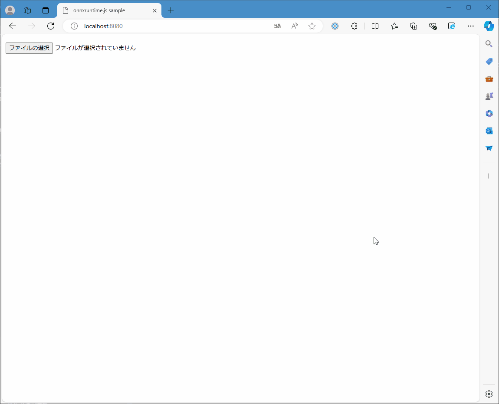

# Get Started

## Abstracts

* Input MNIST image and predict number

## Requirements

### Common

* Powershell 7 or later

## Dependencies

* [ONNX Runtime](https://onnxruntime.ai/)
  * 1.18.1
  * MIT license

## How to build?

### libsodium and Nginx

Go to [WebAssembly](..).

````shell
$ pwsh build.ps1
````

and Go to [00_GetStarted](.).

````shell
$ pwsh BuildNginx.ps1
````

Once time you built `onnxruntime` and `nginx`, you need not to do again.

## How to test?

````shell
$ pwsh Run.ps1
````

Then, `nginx` listen `8080`.

