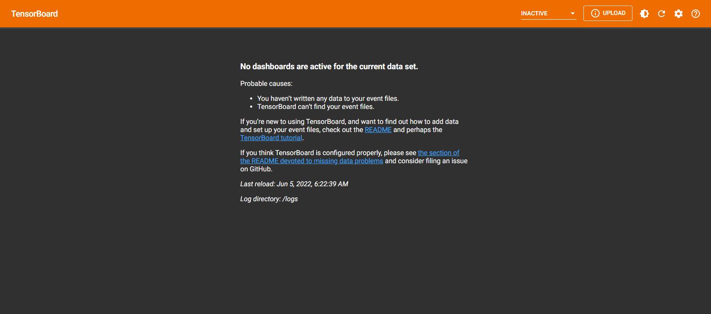

# Tensorboard

## Abstacts

* Tensorboard docker

## Requirements

* Docker

## How to usage?

````cmd
$ run.bat
````

After this, you can see Tensorboard via web browser.
Access to http://localhost:10000


[](./images/tensorboard.png)