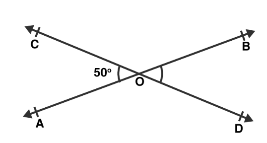

# Angle Between Two Straight Lines

## Abstracts

* How to calc angle two line segment
  * Assumes that providing 2 line segments and there are 4 points



## Requirements

* Powershell 7 or later
* CMake 3.0.0 or later

## Windows

* Visual Studio 2022

## Linux

* GCC

## OSX

* XCode

## How to usage?

````cmd
$ pwsh Build.ps1

Test case 1: 45
Test case 2: 45
Test case 3: 1.20742e-06
OK
````