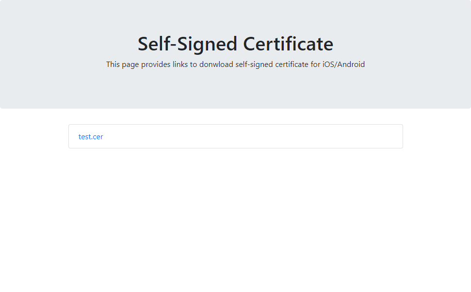

# Distribute Self Signed Cert

## Abstracts

* How to distribute Self Signed Certification via nginx

## Requirements

* docker

## Dependencies

* [Bootstrap 4.0](https://getbootstrap.com/docs/4.0/getting-started/download/)
  * MIT license

## How to usage?

Modify [index.html](./src/index.html).
And copy Self Signed Certification files to [src](./src).

Then,

````cmd
$ run.bat
````

or

````cmd
$ ./run.sh
````

After this. you can see webpage via web browser.

[](./images/image.png)