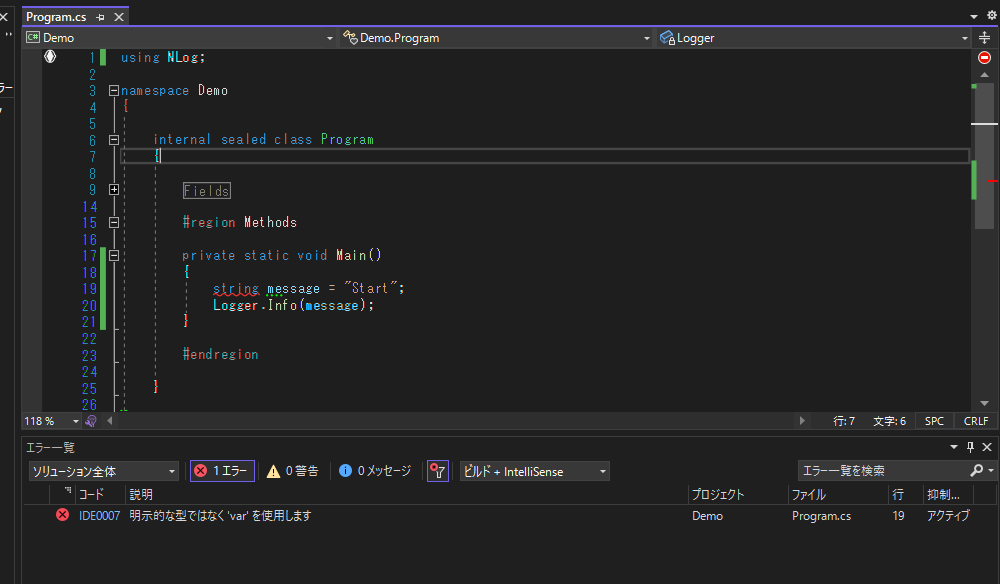
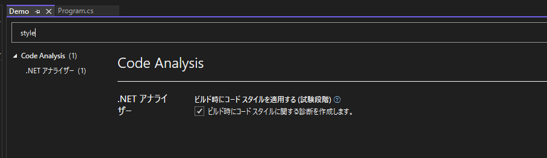

# Enforce Code Style In Build for C#

## Abstracts

* Check coding style when build for C# project

## Requirements

* Visual Studio 2019 or later

## Dependencies

* N/A

## How to use

You just build project.
And you can see build error messages in error list.



You can modify coding style by editing [.editorconfig](./sources/Demo/.editorconfig).

````ini
[*.cs]
csharp_style_var_elsewhere = true:error
csharp_style_var_for_built_in_types = true:error
csharp_style_var_when_type_is_apparent = true:error

# IDE0007: 'var' preferences
dotnet_diagnostic.IDE0007.severity = error
````

[.editorconfig](./sources/Demo/.editorconfig) affects to only project rather than solution wide.
So you have to add .editorconfig` to each projects and enables `EnforceCodeStyleInBuild` attribute in project file.

