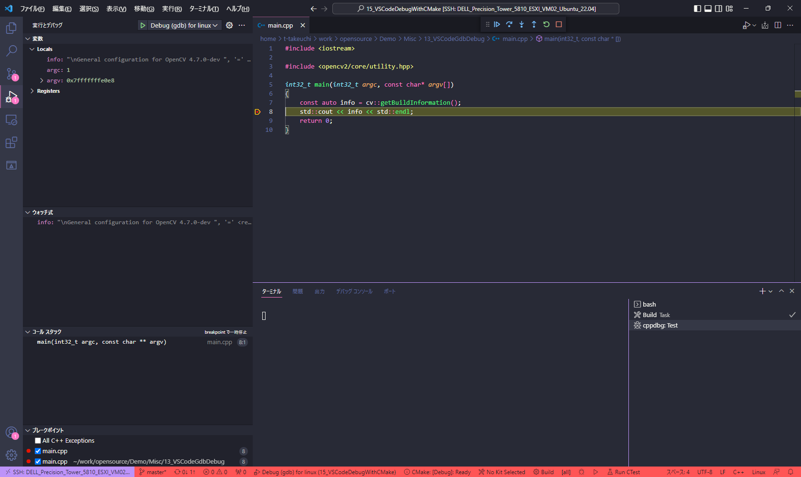

# Debug CMake program with opencv from Visual Studio Code

## Abstracts

* Build and attach program from Visual Studio Code
  * Build by cmake

## Requirements

## Common

* Powershell
* CMake 3.20.0 or later

### Ubuntu

* g++
* build-essential
* gdb

## How to usage?

1. Open [15_VSCodeDebugWithCMake](./) as workspace on Visual Studio Code
2. Build opencv by using `pwsh build-opencv.ps1`
2. Press F5 key
3. You can attach to [main.cpp](./main.cpp)

