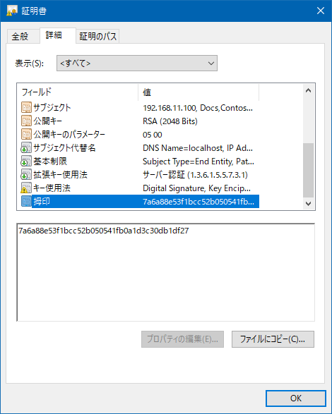

# Mutual TLS with pinning

## Abstracts

* How to use Mutual TLS (mTLS) for nginx
* Client use certificate pinning

## Requirements

### Common

* Powershell 7 or later
* .NET 8.0 or later

## How to run?

At first, you must create client certificates from server certificates.
Please refer [WebApplication/nginx/01_MutualTLS](../../WebApplication/nginx/01_MutualTLS).

And you need to get thumbprint of server certificate.
For example of using openssl,

````bash
$ openssl x509 -in server-cert.pem -noout -sha1 -fingerprint
sha1 Fingerprint=7A:6A:88:E5:3F:1B:CC:52:B0:50:54:1F:B0:A1:D3:C3:0D:B1:DF:27
````

Or download server certificate from browser and check it.



### Windows

You must install Root CA certificate into **Trusted Root Certification Authorities**.
In other words, you will error message `The remote certificate is invalid because of errors in the certificate chain: PartialChain`.

````bash
$ cd sources\Demo
$ dotnet run -c Release -- https://192.168.11.100 client.pfx password 7A6A88E53F1BCC52B050541FB0A1D3C30DB1DF27
2025-03-20 21:16:48.4922 [INFO ] Thumbprint of server certificate: 7A6A88E53F1BCC52B050541FB0A1D3C30DB1DF27 
2025-03-20 21:16:48.5103 [INFO ] <!DOCTYPE html>
<html>
<head>
<title>Welcome to nginx!</title>
<style>
html { color-scheme: light dark; }
body { width: 35em; margin: 0 auto;
font-family: Tahoma, Verdana, Arial, sans-serif; }
</style>
</head>
<body>
<h1>Welcome to nginx!</h1>
<p>If you see this page, the nginx web server is successfully installed and
working. Further configuration is required.</p>

<p>For online documentation and support please refer to
<a href="http://nginx.org/">nginx.org</a>.<br/>
Commercial support is available at
<a href="http://nginx.com/">nginx.com</a>.</p>

<p><em>Thank you for using nginx.</em></p>
</body>
</html>
````

### Linux or MacOS

You must install Root CA certificate into **Keychain** or **ca-certificates**.
In other words, you will error message like `The remote certificate is invalid according to the validation procedure: RemoteCertificateNameMismatch`.

````bash
$ cd sources/Demo
$ dotnet run -c Release -- https://192.168.11.100 client.crt client.decrypted.key 7A6A88E53F1BCC52B050541FB0A1D3C30DB1DF27
2025-03-20 21:16:48.4922 [INFO ] Thumbprint of server certificate: 7A6A88E53F1BCC52B050541FB0A1D3C30DB1DF27 
2025-03-20 21:16:48.5103 [INFO ] <!DOCTYPE html>
<html>
<head>
<title>Welcome to nginx!</title>
<style>
html { color-scheme: light dark; }
body { width: 35em; margin: 0 auto;
font-family: Tahoma, Verdana, Arial, sans-serif; }
</style>
</head>
<body>
<h1>Welcome to nginx!</h1>
<p>If you see this page, the nginx web server is successfully installed and
working. Further configuration is required.</p>

<p>For online documentation and support please refer to
<a href="http://nginx.org/">nginx.org</a>.<br/>
Commercial support is available at
<a href="http://nginx.com/">nginx.com</a>.</p>

<p><em>Thank you for using nginx.</em></p>
</body>
</html>
````