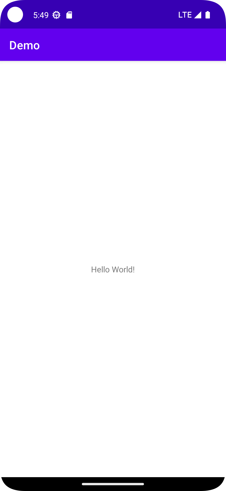

# Minimal

## Abstracts

* Default empty activity project for Kotlin

## Requirements

* Android Studio
* Android 12（API Level 31)

## How to build?

You can build from Android Studio.
Or you can build from command line.

### Generate APK

````shell
$ gradlew <assembleDebug/assembleRelease>
````

You can see `*.apk` file in app/build/outputs/apk.

### Generate Bundle

````shell
$ gradlew bundle
````

You can see `*.aab` file in app/build/outputs/bundle.

## How to usage?

Open this directory on Android Studio and start Run app.

