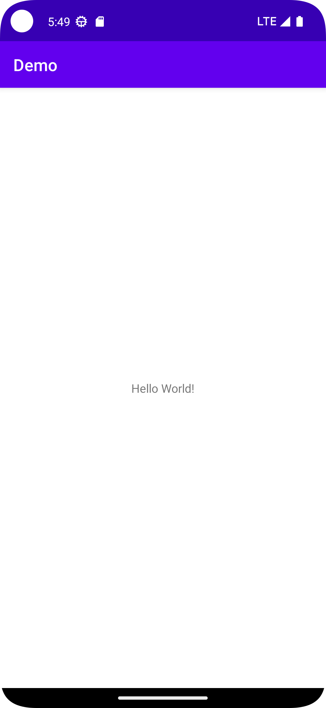

# Minimal

## Abstracts

* Default empty activity project for Kotlin

## Requirements

* Android Studio
* Android 12（API Level 31)

## How to usage?

Open this directory on Android Studio and start Run app.




## Test assetlinks.json

We can verify `assetlinks.json` by using Digital Asset Links API.

 ````shell
 $ curl "https://digitalassetlinks.googleapis.com/v1/statements:list?source.web.site=https://taktak.jp&relation=delegate_permission/common.handle_all_urls"
{
  "statements": [
    {
      "source": {
        "web": {
          "site": "https://taktak.jp."
        }
      },
      "relation": "delegate_permission/common.handle_all_urls",
      "target": {
        "androidApp": {
          "packageName": "takuyatakeuchi.demo.universallinktarget",
          "certificate": {
            "sha256Fingerprint": "73:41:E5:FA:67:F0:E0:59:EA:66:CB:05:B2:8A:34:29:08:26:B2:A9:2B:A7:36:07:0E:8B:25:2F:F2:D4:46:9C"
          }
        }
      }
    }
  ],
  "maxAge": "88.876309048s"
}
 ````


 adb shell am start -W -a android.intent.action.VIEW -d https://taktak.jp/buy takuyatakeuchi.demo.universallinktarget