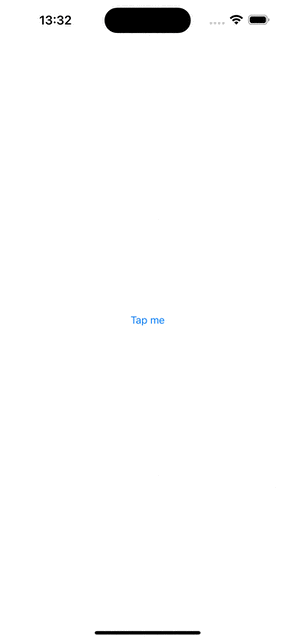

# UIButton and show UIAlertController

## Abstracts

* Ignore Storyboard and construct UI components from code
* Add `UIButton` and binding function into `touchUpInside` event

## Requirements

* Xcode 14.0 or later
* Apple Developer Account with Apple Develop Program

## Project Style

|Term|Value|
|---|---|
|Language|Swift|
|UI Interface|Storyboard|
|UIScene|No|

## Dependencies

N/A

## Screenshots

