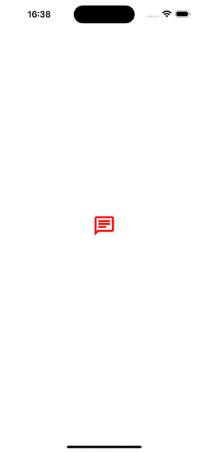

# UIButton and show UIAlertController

## Abstracts

* Ignore Storyboard and construct UI components from code
* Add `UIButton` and binding function into `touchUpInside` event

## Requirements

* Xcode 14.0 or later
* Apple Developer Account with Apple Develop Program

## Project Style

|Term|Value|
|---|---|
|Language|Swift|
|UI Interface|Storyboard|
|UIScene|No|

## Dependencies

|Package|License|
|---|---|
|[SVGKit](https://github.com/SVGKit/SVGKit)|MIT license|

## Assets

|Asset|Url|License|
|---|---|---|
|[chat_FILL0_wght400_GRAD0_opsz24.svg](.//Demo/Assets/chat_FILL0_wght400_GRAD0_opsz24.svg)|[Google Fonts](ttps://fonts.google.com/icons)|Apache license 2.0|

## How to build

You must do the following command before build code in Xcode.

````shell
$ pod install
````

## Screenshots

