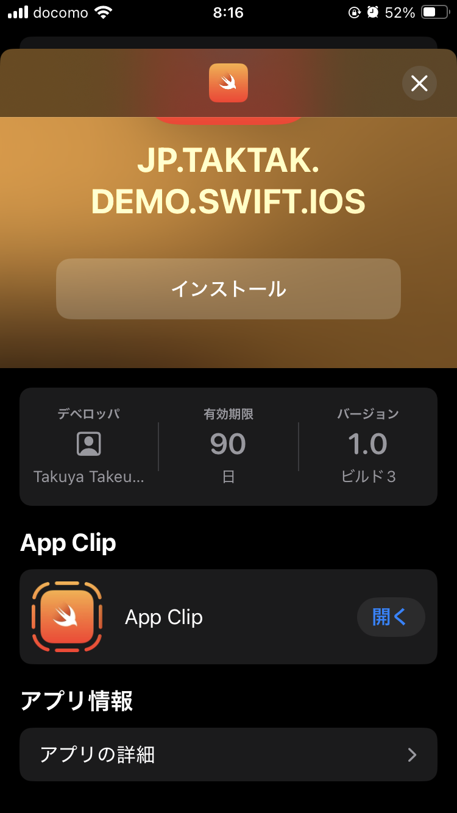

# App Clip

## Abstracts

* Minimum App Clip

## Requirements

* Xcode 16.0 or later
* Apple Developer Account with Apple Develop Program

## Project Style

|Term|Value|
|---|---|
|Language|Swift|
|UI Interface|Storyboard|
|UIScene|No|

## Dependencies

N/A

## How to use?

At first, you must create distribute certificate and provisioning profiles.

Open [ios/Runner.xcworkspace](./ios/Runner.xcworkspace) by Xcode.
Then **Product -> Archive**, and **Distribute App**.
Both main and App Clip apps will be published to App Store Connect.

All that is left is distributing app by TestFlight.

## Screenshots

