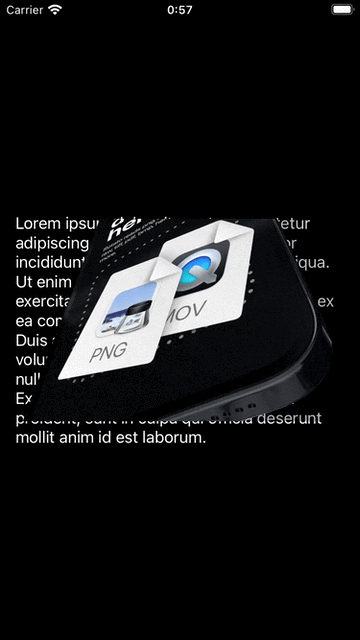

# Transparent Movie

## Abstracts

* Ignore Storyboard and construct UI components from code
* Play transparent movie file by `AVPlayer`

## Requirements

* Xcode 14.0 or later
* Apple Developer Account with Apple Develop Program

## Project Style

|Term|Value|
|---|---|
|Language|Swift|
|UI Interface|Storyboard|
|UIScene|No|

## Dependencies

* N/A

## Assets

|Asset|Url|License|
|---|---|---|
|[movie-webm_1.00.mov](./Demo/Resources/movie-webm_1.00.mov)|Convert [movie-webm.webm](https://rotato.netlify.app/alpha-demo/movie-webm.webm) to hecv|Unknown|

## How to build

You can kick build or run command in Xcode.

## Screenshots

