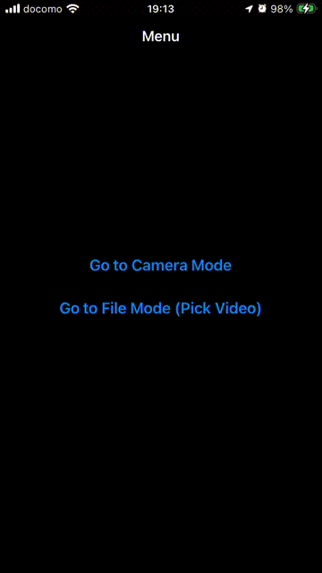

# Frame Processor View

## Abstracts

* Processing camera and video file by common code (delegate)

## Requirements

* Xcode 16.0 or later
* Apple Developer Account with Apple Develop Program

## Project Style

|Term|Value|
|---|---|
|Language|Swift|
|UI Interface|Storyboard|
|UIScene|No|

## Dependencies

N/A

## Assets

|Asset|Url|License|
|---|---|---|
|[production_id_4040354_(1080p).mp4](./Demo/Resources/production_id_4040354_(1080p).mp4)|[Pexels](https://www.pexels.com/video/cherry-flowers-blooming-during-spring-season-4040354/)|[Free to use](https://www.pexels.com/license/)|

## Screenshots

