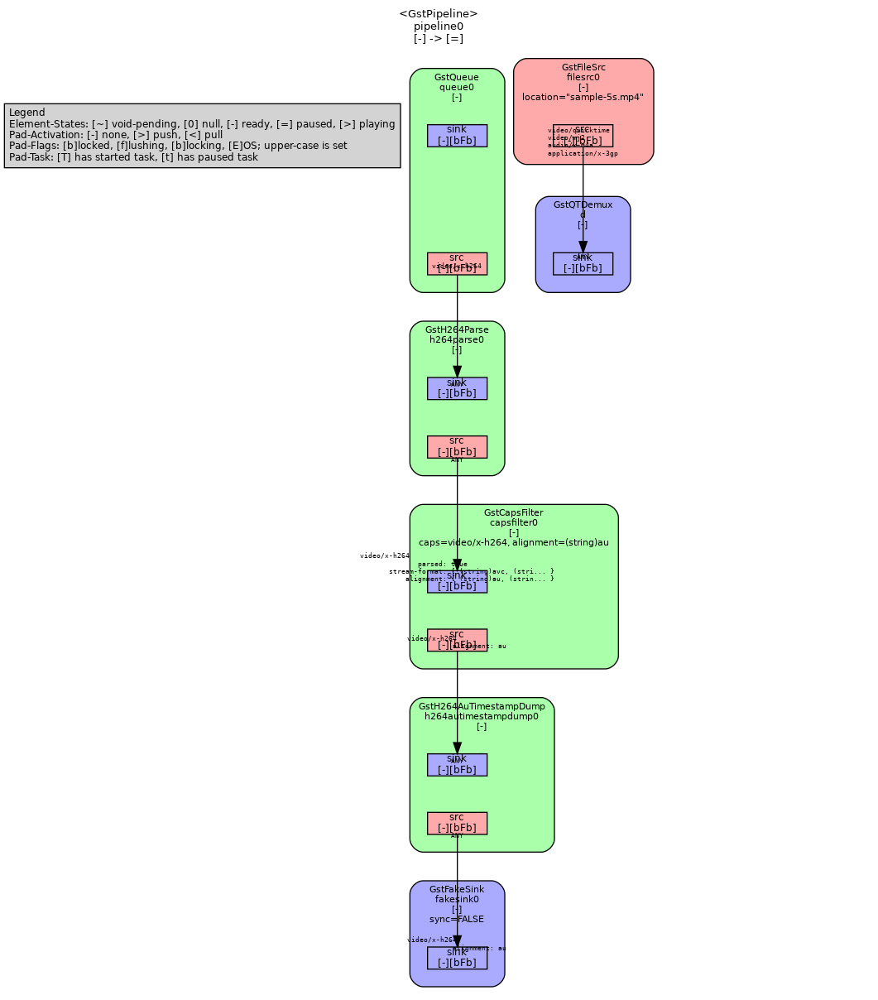

# Timestamp plugins

## Abstracts

* h264autimestampdump
  * Output timestamp per frame data to csv file
* h264auseifromfile
  * Insert SEI (Supplemental Enhancement Information) data into mp4 from csv

## Causion!!

Latest stable (1.28.X) Gstreamer does not support `h264seiinserter`.
`h264seiinserter` is introduces main branch and it would be provided on 1.29.1.
So you need modify gstreamer version in [build-config.json](../build-config.json).

## Requirements

### Common

* Powershell 7 or later
* CMake
  * 3.26 or higher
* ffmpeg

### Windows

* Visual Studio 2022

### Ubuntu

* g++

### OSX

* Xcode
* pkg-config
  * You can install `brew install pkg-config`

## Dependencies

* [GStreamer](https://gstreamer.freedesktop.org/)
  * GNU General Public License (GPL) version 2.1

## TestData

* [sample-5s.mp4](./sample-5s.mp4)
  * [Test video of a road in a city](https://samplelib.com/sample-mp4.html)
  * License: [License](https://samplelib.com/license.html)

## How to build?

### GStreamer

Go to [GStreamer](..).

Once time you built `GStreamer`, you need not to do again.

````shell
$ pwsh build.ps1 <Debug/Release>
````

## How to test?

#### Linux

````bash
$ pwsh test.ps1 Release

Setting pipeline to PAUSED ...
Pipeline is PREROLLING ...
Redistribute latency...
Pipeline is PREROLLED ...
Setting pipeline to PLAYING ...
Redistribute latency...
New clock: GstSystemClock
Got EOS from element "pipeline0".
EOS received - stopping pipeline...
Execution ended after 0:00:00.002494105
Setting pipeline to NULL ...
Freeing pipeline ...
Setting pipeline to PAUSED ...
Pipeline is PREROLLING ...
Redistribute latency...
Redistribute latency...
Pipeline is PREROLLED ...
Setting pipeline to PLAYING ...
Redistribute latency...
New clock: GstSystemClock
Got EOS from element "pipeline0".
EOS received - stopping pipeline...
Execution ended after 0:00:00.009721145
Setting pipeline to NULL ...
Freeing pipeline ...

$ ffmpeg -i sample-5s.with_sei.mp4 -map 0:v:0 -c:v copy -bsf:v h264_mp4toannexb -f h264 out.h264
$ python3 read_sei.py out.h264
[MATCH] nal_index=3
  uuid = 09452e60-e626-c69e-a7ad-5ad265449e64
  body_len = 16
  version = 1
  wallclock_ns = 1774035500496559000 (2026-03-20 19:38:20.496559+00:00)
[MATCH] nal_index=5
...
  wallclock_ns = 1774035500499251000 (2026-03-20 19:38:20.499251+00:00)
[MATCH] nal_index=343
  uuid = 09452e60-e626-c69e-a7ad-5ad265449e64
  body_len = 16
  version = 1
  wallclock_ns = 1774035500499259000 (2026-03-20 19:38:20.499259+00:00)
````

#### OSX

````shell
$ pwsh test.ps1 Release

Setting pipeline to PAUSED ...
Pipeline is PREROLLING ...
Redistribute latency...
Pipeline is PREROLLED ...
Setting pipeline to PLAYING ...
Redistribute latency...
New clock: GstSystemClock
Got EOS from element "pipeline0".
EOS received - stopping pipeline...
Execution ended after 0:00:00.001007417
Setting pipeline to NULL ...
Freeing pipeline ...
Setting pipeline to PAUSED ...
Pipeline is PREROLLING ...
Redistribute latency...
Redistribute latency...
Pipeline is PREROLLED ...
Setting pipeline to PLAYING ...
Redistribute latency...
New clock: GstSystemClock
Got EOS from element "pipeline0".
EOS received - stopping pipeline...
Execution ended after 0:00:00.003105375
Setting pipeline to NULL ...
Freeing pipeline ...

$ ffmpeg -i sample-5s.with_sei.mp4 -map 0:v:0 -c:v copy -bsf:v h264_mp4toannexb -f h264 out.h264
$ python3 read_sei.py out.h264
[MATCH] nal_index=3
  uuid = 09452e60-e626-c69e-a7ad-5ad265449e64
  body_len = 16
  version = 1
  wallclock_ns = 1774070237009572000 (2026-03-21 05:17:17.009572+00:00)
[MATCH] nal_index=5
...
  wallclock_ns = 1774070237010618000 (2026-03-21 05:17:17.010618+00:00)
[MATCH] nal_index=343
  uuid = 09452e60-e626-c69e-a7ad-5ad265449e64
  body_len = 16
  version = 1
  wallclock_ns = 1774070237010621000 (2026-03-21 05:17:17.010621+00:00)
````

## Note

[test.ps1](./test.ps1) dump gstreamer pipeline as dot files into [dot](./dot) directory.
You can visualize thems by `dot`.
For examples,

````bash
$ dot -Grankdir=TB -Tpng dot/0.00.00.016787036-gst-launch.NULL_READY.dot -o test.png
````

