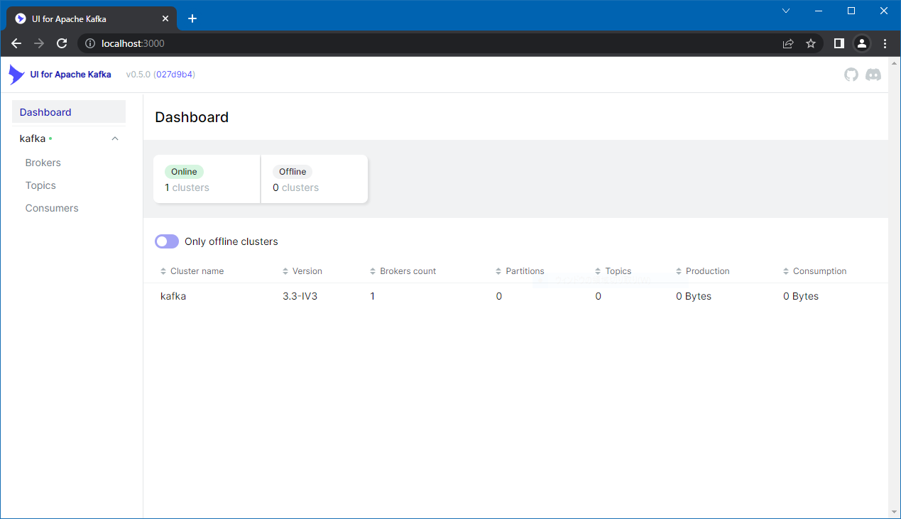

# Quick Start

## Abstracts

* Try Kafka and Zookerper on host machine

## Requirements

### Common

* Java
  * Set `JAVA_HOME` environmental variable
  * Java 8, 11 or 17 are supported.
    * [Java Version](https://kafka.apache.org/documentation/#java)
* Powershell 7 or later
* tar command
  * Windows 10 or later has native support

#### for docker

* docker
* docker compose

## Dependencies

* [Apache Kafka](https://kafka.apache.org/)
  * 3.3.0
  * Apache License 2.0

### docker

* [confluentinc/cp-kafka](https://hub.docker.com/r/confluentinc/cp-kafka/tags)
  * 7.3.2
    * You can see that 7.3.2 corresponds to 3.3.0 in [Supported Versions and Interoperability for Confluent Platform](https://docs.confluent.io/platform/current/installation/versions-interoperability.html)

## How to start?

### On host machine

````sh
$ pwsh
$ Invoke-WebRequest https://dlcdn.apache.org/kafka/3.3.0/kafka_2.13-3.3.0.tgz -OutFile kafka.tgz
$ mkdir kafka && tar -xzf kafka.tgz -C kafka --strip-components 1 && Remove-Item kafka.tgz
$ pwsh Start.ps1
````

### NOTE

For windows, `kafka` directory should be in root directory of drive.
Because java classpath will be too long and throw exception.

## docker

````sh
$ docker network create kafka_network
$ docker compose up -d
````

You can browse web interface for kafka from [http://localhost:3000](http://localhost:3000)

