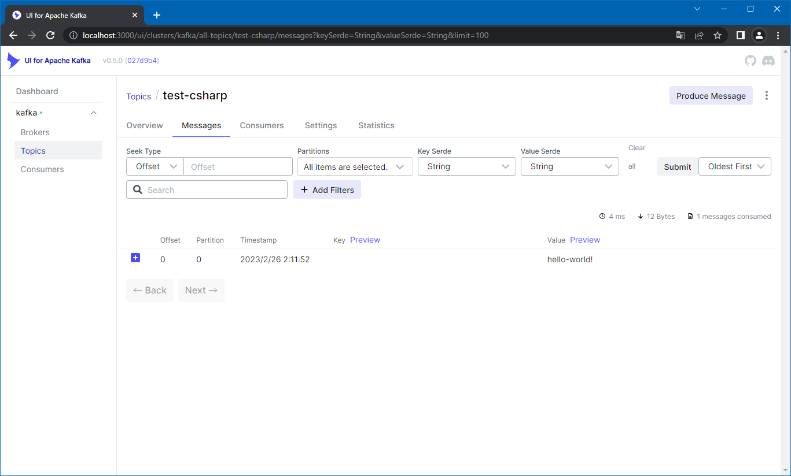

# Producer

## Abstracts

* Create topic and publish

## Requirements

### Common

* .NET 7.0

## Dependencies

* [Confluent.Kafka](https://github.com/confluentinc/confluent-kafka-dotnet)
  * 2.0.2
  * Apache License 2.0
* [NLog](https://github.com/NLog/NLog)
  * 5.1.2
  * BSD-3-Clause license

## How to use?

````sh
$ dotnet run -c Release -- localhost:9092 test-csharp hello-world!
2023-02-26 02:11:54.4062 [INFO ] Delivered 'hello-world!' to 'test-csharp [[0]] @0'
````

