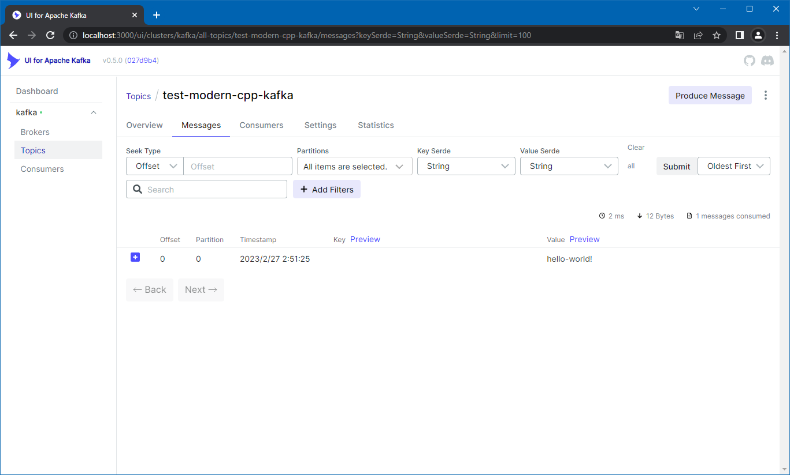

# Producer

## Abstracts

* Create topic and publish

## Requirements

### Common

* Powershell 7 or later
* CMake 3.0.0 or later
* C++ Compiler supports C++14

### Windows

* Visual Studio
* librdkafka, gtest, boost-optional, boost-algorithm, boost-program-options, rapidjson and lz4
  * via `vcpkg` command
    * `vcpkg install librdkafka gtest boost-optional boost-algorithm boost-program-options rapidjson lz4 --triplet x64-windows`

### Ubuntu

* g++
* libcpprest-dev
  * via `apt` command
    * `apt install librdkafka-dev`

### OSX

* Xcode
* cpprestsdk
  * via `brew` command

## Dependencies

* [boost](https://www.boost.org/)
  * 1.80.0
  * Boost Software License
* [googletest](https://github.com/google/googletest)
  * 1.12.1
  * BSD-3-Clause license
* [librdkafka](https://github.com/confluentinc/librdkafka)
  * 1.9.2
  * BSD-2-Clause license
* [LZ4](https://github.com/lz4/lz4)
  * 1.9.3
  * BSD-2-Clause license
* [rapidjson](https://github.com/Tencent/rapidjson)
  * 2022-06-28
  * MIT license

## How to build?

### modern-cpp-kafka

Go to [modern-cpp-kafka](../modern-cpp-kafka).

````shell
$ pwsh build.ps1 <Debug/Release>
````

Once time you built `modern-cpp-kafka`, you need not to do again.

````shell
$ pwsh build.ps1 <Debug/Release>
````

## How to test?

````bat
$ install\win\bin\Demo localhost:9092 test-modern-cpp-kafka hello-world!
[2023-02-27 02:51:25.487981]NOTICE KafkaProducer[3e8a87e0-e90b739b] initializes with properties[bootstrap.servers=localhost:9092|client.id=3e8a87e0-e90b739b|log_level=5]
Message delivered: test-modern-cpp-kafka-0@0,CreateTime[2023-02-27 02:51:25.488],Persisted
[2023-02-27 02:51:26.497086]NOTICE KafkaProducer[3e8a87e0-e90b739b] closed
````

