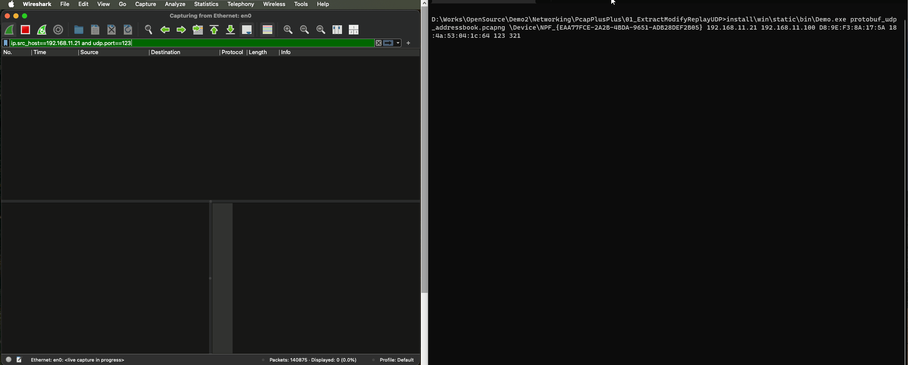

# Extract-Modify-Replay UDP packet

## Abstracts

* Extract, modify and replay UDP packets in pcap file

## Requirements

### Common

* Powershell 7 or later
* CMake 3.12 or later
* C++ Compiler

### Windows

* Visual Studio

### Ubuntu

* g++

### OSX

* Xcode

## Dependencies

* [Npcap](https://npcap.com/#download)
  * 1.15
  * [License](https://npcap.com/oem/)
* [PcapPlusPlus](https://github.com/seladb/PcapPlusPlus)
  * v25.05
  * Unlicense License

## Sample Data

* [protobuf_udp_addressbook.pcapng](https://wiki.wireshark.org/uploads/e2b98423e5f0dc85e0b1228ebbd044e2/protobuf_udp_addressbook.pcapng)
  * Unknown License

## How to build?

### PcapPlusPlus

Go to [PcapPlusPlus++](..).
Once time you built `PcapPlusPlus`, you need not to do again.

## How to build?

````shell
$ pwsh build.ps1 <Debug/Release>
````

## How to test?

You must get the following informations.

* Device Name (devName)
  * For Windows, you can use [00_GetStarted](../00_GetStarted) to collect device name.
* Source IP address (SrcIP)
* Target IP address (DstIP)
* Source Mac address (srcMac)
* Target Mac address (dstMac)
  * If target IP address is different network segment, you must get router's mac address
* Source Port Number (newSrcPort)
* Target Port Number (newDstPort)

#### Windows

Pass arguments you got on the previous section.

````bat
$ install\win\static\bin\Demo.exe protobuf_udp_addressbook.pcapng \Device\NPF_{EAA77FCE-2A2B-4BDA-9651-ADB28DEF2B05} 192.168.11.21 192.168.11.100 D8:9E:F3:8A:17:5A 18:4a:53:04:1c:64 123 321
pcapFile: protobuf_udp_addressbook.pcapng
 devName: \Device\NPF_{EAA77FCE-2A2B-4BDA-9651-ADB28DEF2B05}
  srcMac: 192.168.11.21
  dstMac: 192.168.11.100
  srcMac: d8:9e:f3:8a:17:5a
  dstMac: 18:4a:53:04:1c:64
 srcPort: 123
 dstPort: 321
Sent 1 UDP packets.
````



#### OSX

Pass arguments you got on the previous section.

````bash
$ ./install/osx/static/bin/Demo protobuf_udp_addressbook.pcapng en0 192.168.11.100 192.168.11.21 18:4a:53:04:1c:64 D8:9E:F3:8A:17:5A 321 123
pcapFile: protobuf_udp_addressbook.pcapng
 devName: en0
  srcMac: 192.168.11.100
  dstMac: 192.168.11.21
  srcMac: 18:4a:53:04:1c:64
  dstMac: d8:9e:f3:8a:17:5a
 srcPort: 321
 dstPort: 123
Sent 1 UDP packets.
````