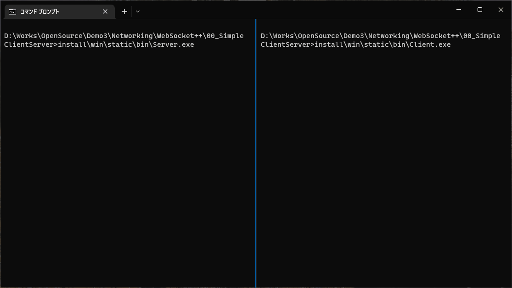

# Echo client and server

## Abstracts

* Run clinet and server apps (show message when connecting/connected)

## Requirements

### Common

* Powershell 7 or later
* CMake
  * 3.5 or higher

### Windows

* Visual Studio 2022

### Ubuntu

* g++

### OSX

* Xcode

## Dependencies

* [Boost](https://www.boost.org/)
  * v1.86.0
  * Boost License
* [OpenSSL](https://www.openssl.org/)
  * 3.0 or later: Apache License 2.0
  * 1.x and earlier: OpenSSL License
* [WebSocket++](https://github.com/zaphoyd/websocketpp)
  * 0.8.2
  * BSD-3-Clause License

## How to build?

### WebSocket++ and Boost

Go to [WebSocket++](..).
Once time you built `WebSocket++` and `Boost`, you need not to do again.

### OpenSSL

we can build it by myself.
Go to [OpenSSL](../../../Security/OpenSSL).

After built it, you must set `OPENSSL_ROOT_DIR` environmental variable to ignore system installed `OpenSSL`.
For example,

````shell
$ set OPENSSL_ROOT_DIR=D:\Works\OpenSource\Demo\Security\OpenSSL\install\win\openssl\3.3.2\static
````

## How to build?

````shell
$ pwsh build.ps1 <Debug/Release>
````

## How to test?

