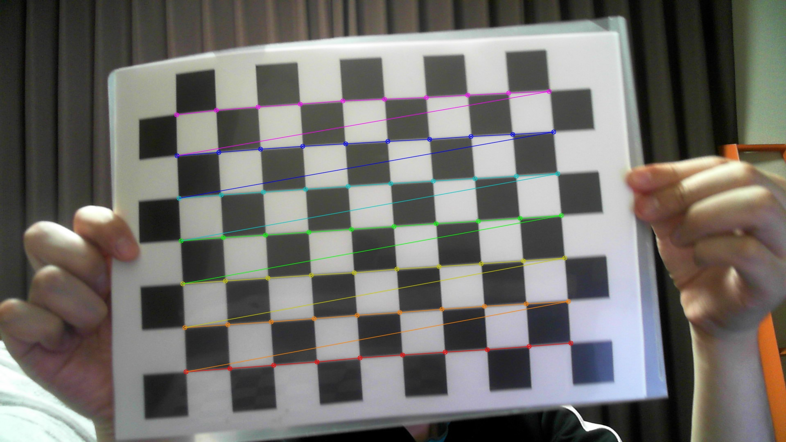

# Calibrate Camera

## Abstracts

* How to calibrate camera
* Get intrinsic parameter

## Requirements

* Visual Studio 2022
* .NET 6.0

## Dependencies

* [OpenCVSharp](https://github.com/shimat/opencvsharp)
  * Apache License 2.0
* [NLog](https://github.com/NLog/NLog)
  * BSD-3-Clause License
* [CommandLineParser](https://github.com/commandlineparser/commandline)
  * MIT License
* [Fluent Validation](https://github.com/FluentValidation/FluentValidation)
  * Apache License 2.0

## How to usage?

````cmd
$ dotnet run -c Release --horizontal 10 --vertical 7 --size 2.5 --count 40 --output
````

## Result

This program outputs calibration.yaml.

````yaml
%YAML:1.0
---
Count: 40
ChessSize: 2.5000000000000000e+00
FrameWidth: 1920
FrameHeight: 1080
PatternRow: 7
PatternColumn: 10
RMS: 9.3106933225963417e-01
CameraIntrinsicMatrix: !!opencv-matrix
   rows: 3
   cols: 3
   dt: d
   data: [ 8.4569559630144831e+03, 0., 1.1819343208144614e+03, 0.,
       6.5932463583830449e+03, 7.6336698447080073e+02, 0., 0., 1. ]
DistortionCoefficients: !!opencv-matrix
   rows: 1
   cols: 5
   dt: d
   data: [ -5.9896389638189911e+00, 1.7054778558550743e+02,
       -1.7805915240619394e-01, -1.3186931420483941e-01,
       -2.6837063125151612e+03 ]
````

[](./images/captured.jpg)

## Misc

You can download chess pattern from [chesspattern_7x10.pdf](http://opencv.jp/sample/pics/chesspattern_7x10.pdf).