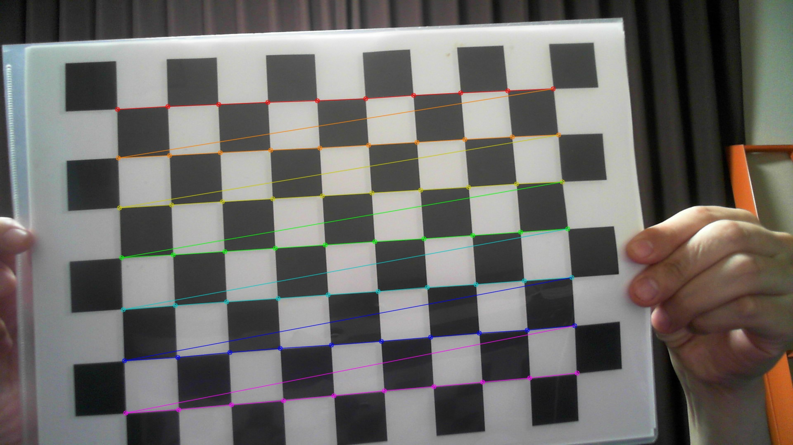
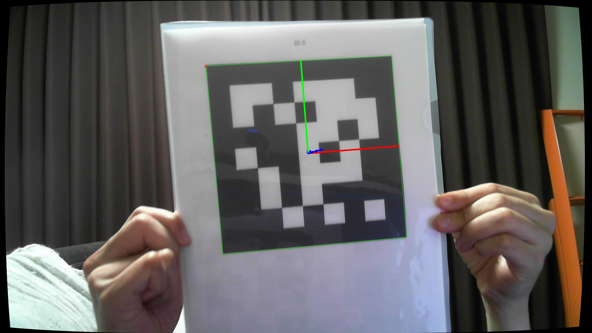

# ArUco Marker

## Abstacts

* How to detect ArUco marker

## Requirements

* Visual Studio 2022
* .NET 6.0

## Dependencies

* [OpenCVSharp](https://github.com/shimat/opencvsharp)
  * Apache License 2.0
* [NLog](https://github.com/NLog/NLog)
  * BSD-3-Clause License
* [CommandLineParser](https://github.com/commandlineparser/commandline)
  * MIT License
* [Fluent Validation](https://github.com/FluentValidation/FluentValidation)
  * Apache License 2.0

## How to usage?

````cmd
$ python calibrate.py --horizontal 10 --vertical 7 --size 2.5 --count 100 --output
$ python aruco.py --size 0.15 --dictionary DICT_7X7_50 --output
````

|Dictionary Name|
|---|
|DICT_4X4_50|
|DICT_4X4_100|
|DICT_4X4_250|
|DICT_4X4_1000|
|DICT_5X5_50|
|DICT_5X5_100|
|DICT_5X5_250|
|DICT_5X5_1000|
|DICT_6X6_50|
|DICT_6X6_100|
|DICT_6X6_250|
|DICT_6X6_1000|
|DICT_7X7_50|
|DICT_7X7_100|
|DICT_7X7_250|
|DICT_7X7_1000|
|DICT_ARUCO_ORIGINAL|
|DICT_APRILTAG_16h5|
|DICT_APRILTAG_25h9|
|DICT_APRILTAG_36h10|
|DICT_APRILTAG_36h11|

## Result

[](./images/calibrate.jpg)

[](./images/detect.jpg)

## Misc

You can download chess pattern from [chesspattern_7x10.pdf](http://opencv.jp/sample/pics/chesspattern_7x10.pdf).
And you can download ArUci marker sheet from [ArUco marker sheet generator!](https://fodi.github.io/arucosheetgen/) and [ArUco markers generator!](https://chev.me/arucogen/).

### ArUco marker sheet generator!

[DICT_7X7_50_100_250_1000_0_20_20.pdf](DICT_7X7_50_100_250_1000_0_20_20.pdf) is generated from

|Key|Value|
|---|---|
|Dictionary|7x7 (50, 100, 250, 1000)|
|First marker ID|0|
|Last marker ID|20|
|Maeker size, mm|20|

### ArUco markers generator!

[DICT_7X7_50_100_250_1000_0_150.pdf](DICT_7X7_50_100_250_1000_0_150.pdf) is generated from

|Key|Value|
|---|---|
|Dictionary|7x7 (50, 100, 250, 1000)|
|Marker ID|0|
|Maeker size, mm|150|