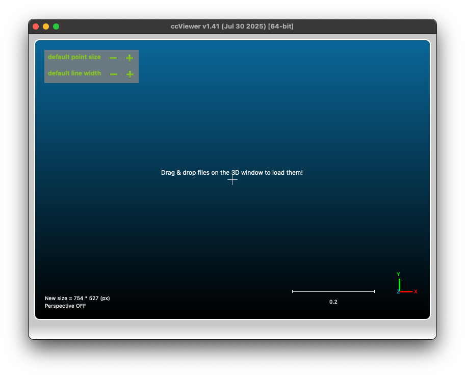

# CloudCompare

## Abstracts

* Build PcapPlusPlus
* Sample and experimental codes

## Requirements

### Common

* Powershell 7 or later
* CMake 3.10 or later
* C++ Compiler

### Windows

* Visual Studio
* Windows 10 SDK
  * Build for Qt5

### Ubuntu

* g++

### OSX

* Xcode

## Dependencies

* [CloudCompare](https://github.com/CloudCompare/CloudCompare)
  * v2.13.2
  * GNU General Public License (GPL) version 2.0
* [Qt]
  * 5.15.2
  * Multiple licenses
    * GNU Free Documentation License (GFDL) version 1.3
    * GNU General Public License (GPL) version 2.0
    * GNU General Public License (GPL) version 3.0
    * GNU Lesser General Public License (LGPL) version 2.1
    * GNU Lesser General Public License (LGPL) version 3.0

## How to build?

### Windows

````shell
$ git submodule update --init --recursive .


$ pwsh build.ps1 <Debug/Release>
````

### Linux

````shell
$ git submodule update --init --recursive .

# build Qt5
$ sudo apt -y install qtbase5-dev
$ sudo apt -y install build-essential perl python3 git
$ sudo apt -y install '^libxcb.*-dev' libx11-xcb-dev libglu1-mesa-dev libxrender-dev libxi-dev libxkbcommon-dev libxkbcommon-x11-dev
$ sudo apt -y install flex bison gperf libicu-dev libxslt-dev ruby
$ sudo apt -y install libxcursor-dev libxcomposite-dev libxdamage-dev libxrandr-dev libxtst-dev libxss-dev libdbus-1-dev libevent-dev libfontconfig1-dev libcap-dev libpulse-dev libudev-dev libpci-dev libnss3-dev libasound2-dev libegl1-mesa-dev gperf bison nodejs
$ sudo apt -y install libunwind-dev libasound2-dev libgstreamer1.0-dev libgstreamer-plugins-base1.0-dev libgstreamer-plugins-good1.0-dev libgstreamer-plugins-bad1.0-dev
$ sudo apt -y install clang libclang-dev
$ export LLVM_INSTALL_DIR=/usr/llvm
$ mkdir -p build/linux/qt5
$ mkdir -p install/linux/qt5
$ git -C qt5 submodule update --init --recursive
$ cp patch/linux/qt5/qtbase/src/corelib/global/qglobal.h qt5/qtbase/src/corelib/global/qglobal.h
$ cd build/linux/qt5
## build ad lgpl (-confirm-license flags)
$ ../../../qt5/configure -developer-build -opensource -nomake examples -nomake tests -confirm-license --prefix=../../../install/linux/qt5 -release
$ make -j$(nproc)
$ make install

$ pwsh build.ps1 <Debug/Release>
````

### OSX

````shell
$ git submodule update --init --recursive .
$ brew install qt@5
$ pwsh build.ps1 <Debug/Release>  
$ sudo codesign --force --deep --sign - ./install/osx/CloudCompare/ccViewer/ccViewer.app    
````

