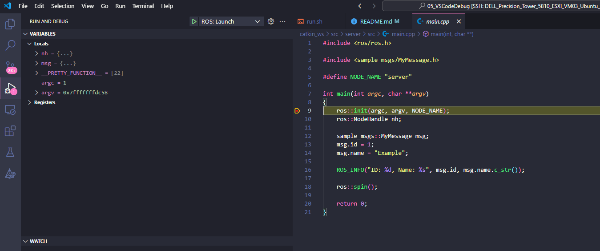
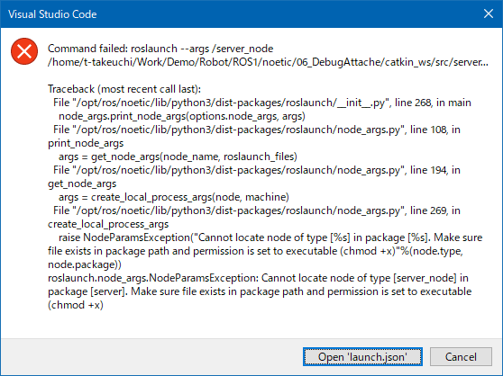

# Debug on Visual Studio Code

## Abstracts

* Debug C++ ros node on Visual Studio Code
  * You can debug from remote host

## Requirements

### Common

* ROS Noetic

## Dependencies

* [ROS](https://github.com/ros/ros)
  * Noetic
  * BSD-3-Clause license
* [Visual Studio Code Extension for ROS](https://github.com/ms-iot/vscode-ros)
  * v0.9.2
  * MIT license

## How to build?

At first, install [Visual Studio Code Extension for ROS](https://github.com/ms-iot/vscode-ros) into Visual Studo Code.
Then, build catkin workspace as bebug.

````bash
$ ./build.sh
````

## How to debug?

Open [05_VSCodeDebug](.) folder by Visual Studio Code.
Then, Press `F5` key or select `ROS: Launch` from Debug pane on Visual Studo Code.



If modify `program` or `cwd` section in [launch.json](.vscode/launch.json), you should restart Visual Studio Code.
Otherwise, you would face the following error.


