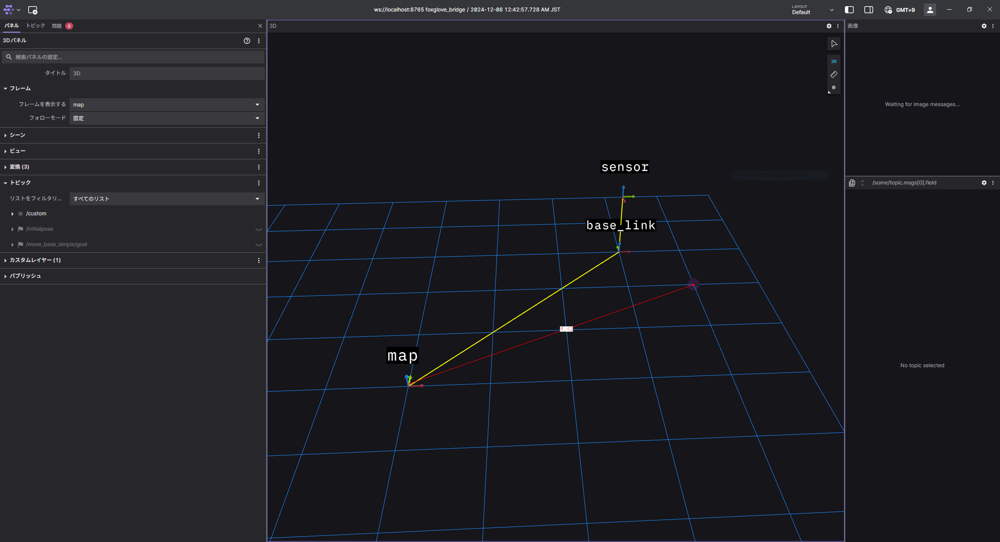

# Transform point by tf2 (Python)

## Abstracts

* Publish PointCloud2 message
* We can visualize transformed points by [Foxglobe Studio](https://app.foxglove.dev/dashboard).
  * But Foxglobe Studio can not visualize all ros tpoic. You can see list of supported messages in [Supported messages](https://docs.foxglove.dev/docs/visualization/panels/3d/#supported-messages).



* Sensor's pose
  * The sensor is at (0.0, 0.0, 1.0) in the `base_link` coordinate system
  * The sensor is rotated -90 degrees (clockwise around the Z axis) relative to the base_link.
* Robot's pose
  * The robot (`base_link`) is at (3.0, 3.0, 0.0) in the `map` coordinate system
  * Tthe robot (`base_link`) has the same orientation (no rotation) as the map (`map`) coordinate system.

## Requirements

### Common

* ROS Noetic
* [tf2_sensor_msgs](https://index.ros.org/p/tf2_sensor_msgs/)
  * `sudo apt-get install ros-$ROS_DISTRO-tf2-sensor-msgs`

## Dependencies

* [ROS](https://github.com/ros/ros)
  * Noetic
  * BSD-3-Clause license

## How to build?

````bash
$ ./build.sh 
~/Work/Demo/Robot/ROS1/noetic/07_TransformPython/catkin_ws ~/Work/Demo/Robot/ROS1/noetic/07_TransformPython
--------------------------------------------------------------------------------------------------------------
Profile:                     default
Extending:          [cached] /opt/ros/noetic
Workspace:                   /home/xxxxxxxxx/Work/Demo/Robot/ROS1/noetic/07_TransformPython/catkin_ws
--------------------------------------------------------------------------------------------------------------
Build Space:        [exists] /home/xxxxxxxxx/Work/Demo/Robot/ROS1/noetic/07_TransformPython/catkin_ws/build
Devel Space:        [exists] /home/xxxxxxxxx/Work/Demo/Robot/ROS1/noetic/07_TransformPython/catkin_ws/devel
Install Space:      [unused] /home/xxxxxxxxx/Work/Demo/Robot/ROS1/noetic/07_TransformPython/catkin_ws/install
Log Space:          [exists] /home/xxxxxxxxx/Work/Demo/Robot/ROS1/noetic/07_TransformPython/catkin_ws/logs
Source Space:       [exists] /home/xxxxxxxxx/Work/Demo/Robot/ROS1/noetic/07_TransformPython/catkin_ws/src
DESTDIR:            [unused] None
--------------------------------------------------------------------------------------------------------------
Devel Space Layout:          linked
Install Space Layout:        None
--------------------------------------------------------------------------------------------------------------
Additional CMake Args:       None
Additional Make Args:        None
Additional catkin Make Args: None
Internal Make Job Server:    True
Cache Job Environments:      False
--------------------------------------------------------------------------------------------------------------
Buildlisted Packages:        None
Skiplisted Packages:         None
--------------------------------------------------------------------------------------------------------------
Workspace configuration appears valid.
--------------------------------------------------------------------------------------------------------------
[build] Found 1 packages in 0.0 seconds.                                                                                                                                                                 
[build] Package table is up to date.                                                                                                                                                                     
Starting  >>> publisher                                                                                                                                                                                  
Finished  <<< publisher                [ 0.2 seconds ]                                                                                                                                                   
[build] Summary: All 1 packages succeeded!                                                                                                                                                               
[build]   Ignored:   None.                                                                                                                                                                               
[build]   Warnings:  None.                                                                                                                                                                               
[build]   Abandoned: None.                                                                                                                                                                               
[build]   Failed:    None.                                                                                                                                                                               
[build] Runtime: 0.3 seconds total.                                                                                                                                                                      
~/Work/Demo/Robot/ROS1/noetic/07_TransformPython
````

## How to run?

````bash
$  ./run_publisher.sh 
~/Work/Demo/Robot/ROS1/noetic/07_TransformPython/catkin_ws ~/Work/Demo/Robot/ROS1/noetic/07_TransformPython
... logging to /home/xxxxxxxxx/.ros/log/2592138a-8ca5-11ef-9cfd-c753b2340ae8/roslaunch-esxi-vm03-2676789.log
Checking log directory for disk usage. This may take a while.
Press Ctrl-C to interrupt
Done checking log file disk usage. Usage is <1GB.

started roslaunch server http://esxi-vm03:44655/

SUMMARY
========

PARAMETERS
 * /rosdistro: noetic
 * /rosversion: 1.17.0

NODES
  /
    publisher1 (publisher/publisher.py)
    static_tf_base_to_sensor (tf2_ros/static_transform_publisher)
    static_tf_map_to_base (tf2_ros/static_transform_publisher)

ROS_MASTER_URI=http://localhost:11311

process[static_tf_base_to_sensor-1]: started with pid [2676806]
process[static_tf_map_to_base-2]: started with pid [2676807]
process[publisher1-3]: started with pid [2676808]
[WARN] [1733585738.172430]: Transform not available yet
[INFO] [1733585738.266543]: Conection started...
[INFO] [1733585738.271541]: x: 4.000, y: 2.000, z: -0.000
[INFO] [1733585738.365607]: x: 4.000, y: 2.000, z: -0.000
````
