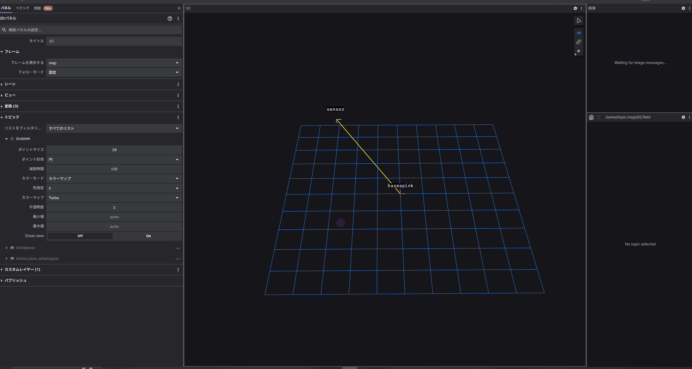
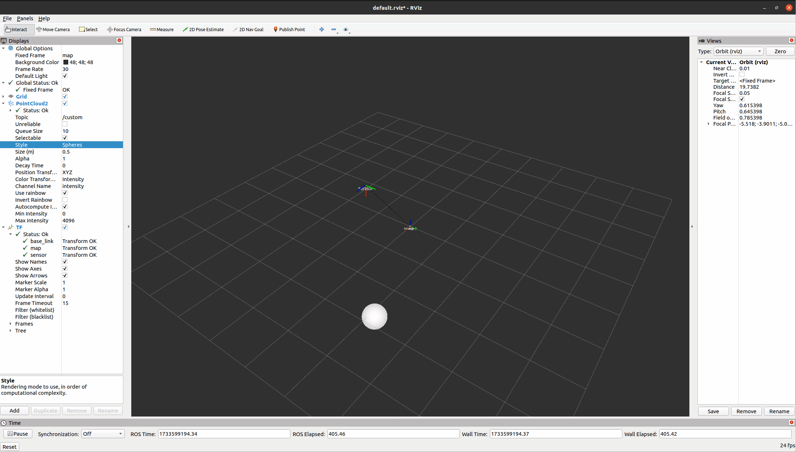

# Dynamic Transform point by tf2 (Python)

## Abstracts

* Publish PointCloud2 message
* We can visualize transformed points by [Foxglobe Studio](https://app.foxglove.dev/dashboard).
  * But Foxglobe Studio can not visualize all ros tpoic. You can see list of supported messages in [Supported messages](https://docs.foxglove.dev/docs/visualization/panels/3d/#supported-messages).





* Sensor's pose
  * The sensor is circling at a height of 3.0 m with a radius of 3.0 m away from the `map`.
  * The sensor is rotated 90 degrees (clockwise around the Z axis) relative to the base_link.
* Robot's pose
  * The robot (`base_link`) is at (0.0, 0.0, 0.0) in the `map` coordinate system
  * Tthe robot (`base_link`) has the same orientation (no rotation) as the map (`map`) coordinate system.

## Requirements

### Common

* ROS Noetic
* [tf2_sensor_msgs](https://index.ros.org/p/tf2_sensor_msgs/)
  * `sudo apt-get install ros-$ROS_DISTRO-tf2-sensor-msgs`

## Dependencies

* [ROS](https://github.com/ros/ros)
  * Noetic
  * BSD-3-Clause license

## How to build?

````bash
$ ./build.sh 
~/Work/Demo/Robot/ROS1/noetic/08_DynamicTransformPython/catkin_ws ~/Work/Demo/Robot/ROS1/noetic/08_DynamicTransformPython
---------------------------------------------------------------------------------------------------------------------
Profile:                     default
Extending:          [cached] /opt/ros/noetic
Workspace:                   /home/xxxxxxxxx/Work/Demo/Robot/ROS1/noetic/08_DynamicTransformPython/catkin_ws
---------------------------------------------------------------------------------------------------------------------
Build Space:        [exists] /home/xxxxxxxxx/Work/Demo/Robot/ROS1/noetic/08_DynamicTransformPython/catkin_ws/build
Devel Space:        [exists] /home/xxxxxxxxx/Work/Demo/Robot/ROS1/noetic/08_DynamicTransformPython/catkin_ws/devel
Install Space:      [unused] /home/xxxxxxxxx/Work/Demo/Robot/ROS1/noetic/08_DynamicTransformPython/catkin_ws/install
Log Space:          [exists] /home/xxxxxxxxx/Work/Demo/Robot/ROS1/noetic/08_DynamicTransformPython/catkin_ws/logs
Source Space:       [exists] /home/xxxxxxxxx/Work/Demo/Robot/ROS1/noetic/08_DynamicTransformPython/catkin_ws/src
DESTDIR:            [unused] None
---------------------------------------------------------------------------------------------------------------------
Devel Space Layout:          linked
Install Space Layout:        None
---------------------------------------------------------------------------------------------------------------------
Additional CMake Args:       None
Additional Make Args:        None
Additional catkin Make Args: None
Internal Make Job Server:    True
Cache Job Environments:      False
---------------------------------------------------------------------------------------------------------------------
Buildlisted Packages:        None
Skiplisted Packages:         None
---------------------------------------------------------------------------------------------------------------------
Workspace configuration appears valid.
---------------------------------------------------------------------------------------------------------------------
[build] Found 1 packages in 0.0 seconds.                                                                                                                                                                 
[build] Package table is up to date.                                                                                                                                                                     
Starting  >>> publisher                                                                                                                                                                                  
Finished  <<< publisher                [ 0.2 seconds ]                                                                                                                                                   
[build] Summary: All 1 packages succeeded!                                                                                                                                                               
[build]   Ignored:   None.                                                                                                                                                                               
[build]   Warnings:  None.                                                                                                                                                                               
[build]   Abandoned: None.                                                                                                                                                                               
[build]   Failed:    None.                                                                                                                                                                               
[build] Runtime: 0.3 seconds total.                                                                                                                                                                      
~/Work/Demo/Robot/ROS1/noetic/08_DynamicTransformPython
````

## How to run?

````bash
$ ./run_publisher.sh 
~/Work/Demo/Robot/ROS1/noetic/08_DynamicTransformPython/catkin_ws ~/Work/Demo/Robot/ROS1/noetic/08_DynamicTransformPython
... logging to /home/xxxxxxxxx/.ros/log/2592138a-8ca5-11ef-9cfd-c753b2340ae8/roslaunch-esxi-vm03-2775678.log
Checking log directory for disk usage. This may take a while.
Press Ctrl-C to interrupt
Done checking log file disk usage. Usage is <1GB.

started roslaunch server http://esxi-vm03:37275/

SUMMARY
========

PARAMETERS
 * /rosdistro: noetic
 * /rosversion: 1.17.0

NODES
  /
    publisher1 (publisher/publisher.py)

ROS_MASTER_URI=http://localhost:11311

process[publisher1-1]: started with pid [2775701]
[INFO] [1733599975.596862]: Conection started...
[INFO] [1733599975.598502]:     sensor - x: -0.308, y: 2.984, z: 3.000
[INFO] [1733599975.602112]: pointcloud - x: -0.308, y: 2.984, z: 0.000
[INFO] [1733599975.685758]:     sensor - x: -0.579, y: 2.944, z: 3.000
[INFO] [1733599975.686841]: pointcloud - x: -0.579, y: 2.944, z: 0.000
[INFO] [1733599975.786981]:     sensor - x: -0.884, y: 2.867, z: 3.000
[INFO] [1733599975.790864]: pointcloud - x: -0.884, y: 2.867, z: 0.000
[INFO] [1733599975.886295]:     sensor - x: -1.178, y: 2.759, z: 3.000
[INFO] [1733599975.889454]: pointcloud - x: -1.178, y: 2.759, z: 0.000
[INFO] [1733599975.986001]:     sensor - x: -1.460, y: 2.621, z: 3.000
[INFO] [1733599975.987989]: pointcloud - x: -1.460, y: 2.621, z: 0.000
[INFO] [1733599976.085937]:     sensor - x: -1.726, y: 2.454, z: 3.000
[INFO] [1733599976.087792]: pointcloud - x: -1.726, y: 2.454, z: 0.000
[INFO] [1733599976.186110]:     sensor - x: -1.973, y: 2.260, z: 3.000
[INFO] [1733599976.187929]: pointcloud - x: -1.973, y: 2.260, z: 0.000
[INFO] [1733599976.286246]:     sensor - x: -2.199, y: 2.041, z: 3.000
[INFO] [1733599976.287900]: pointcloud - x: -2.199, y: 2.041, z: 0.000
````
