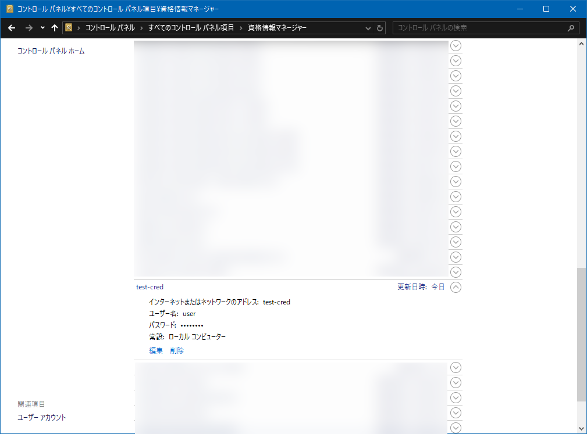

# Get/Save/Delete Credential

## Abstracts

* Get/Save/Delete credential by Credential Manager API

## Requirements

### Common

* Powershell
* CMake 3.0.0 or later
* C++ Compiler supports C++17

### Windows

* Visual Studio

## How to build?

````shell
$ pwsh build.ps1 <Debug/Release>
````

## How to use?

#### Get Credential

````bat
$ .\install\win\bin\Demo.exe 0 test-cred
[Info] Retrieved Username: user
[Info] Retrieved Password: password
````

If specified target name does not exist, `CredReadW` returns false.

````bat
$ .\install\win\bin\Demo.exe 0 test-cred 
[Error] Failed to retrieve credential. ErrorCode: 1168, Error: Element not found.
````

#### Save Credential

````bat
$ .\install\win\bin\Demo.exe 1 test-cred user password 
[Info] Credential saved successfully.
````

Then, you can see specified credential data in Credential Manager.



#### Delete Credential

````bat
$ .\install\win\bin\Demo.exe 2 test-cred              
[Info] Credential deleted successfully.
````

If specified target name does not exist, `CredDeleteW` returns false.

````bat
$ .\install\win\bin\Demo.exe 2 test-cred
[Error] Failed to delete credential. ErrorCode: 1168, Error: Element not found.
````