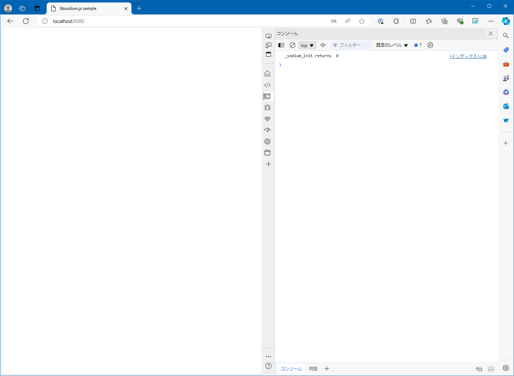

# Get Started

## Abstracts

* Load `libsodium.js` and invoke `sodium_init`

## Requirements

### Common

* Powershell 7 or later
* Docker

## Dependencies

* [libsodium](https://github.com/jedisct1/libsodium)
  * 1.0.20-RELEASE
  * ISC License

## How to build?

### libsodium and Nginx

Go to [WebAssembly](..).

````shell
$ pwsh build.ps1
````

and Go to [00_GetStarted](.).

````shell
$ pwsh BuildNginx.ps1
````

Once time you built `libsodium` and `nginx`, you need not to do again.

## How to test?

````shell
$ pwsh Run.ps1
````

Then, `nginx` listen `8080`.

