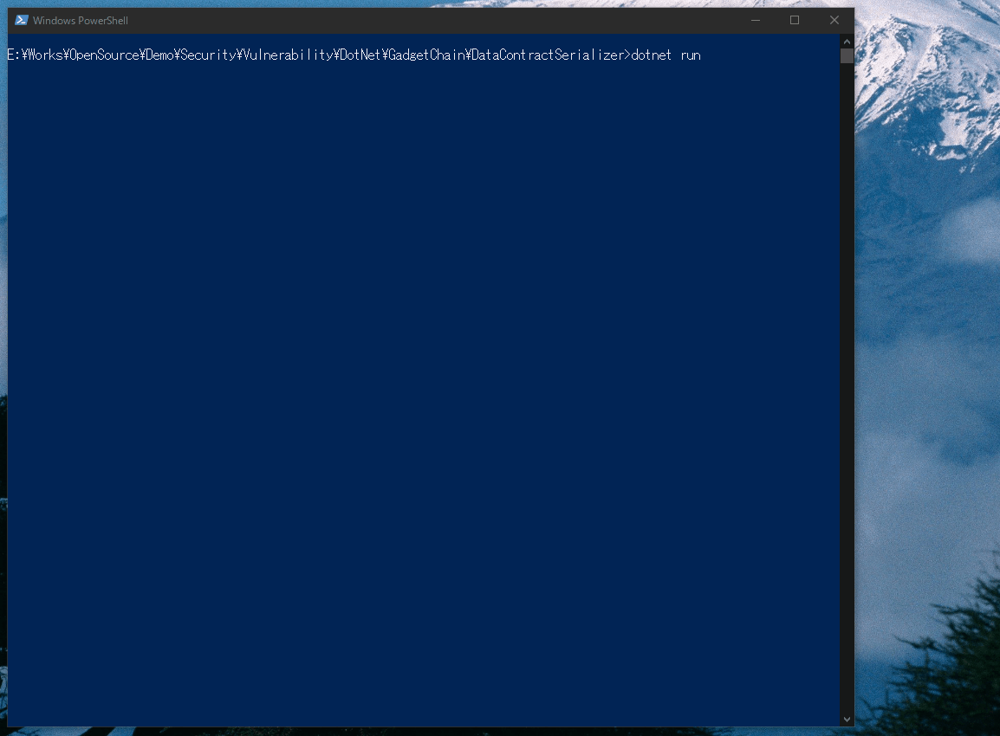

# DataContractSerializer RCE Gadget Chain

## Abstracts

* RCE (Remove Code Execution) by DataContractSerializer
  * Serialized data has doctored SessionSecurityToken object with malicious command
* PoF code from [Finding a New DataContractSerializer RCE Gadget Chain](https://muffsec.com/blog/finding-a-new-datacontractserializer-rce-gadget-chain/)

## Requirements

* .NET Framework 4.8.1

## Dependencies

* [NLog](https://github.com/NLog/NLog)
  * BSD-3-Clause License

## Screenshots

