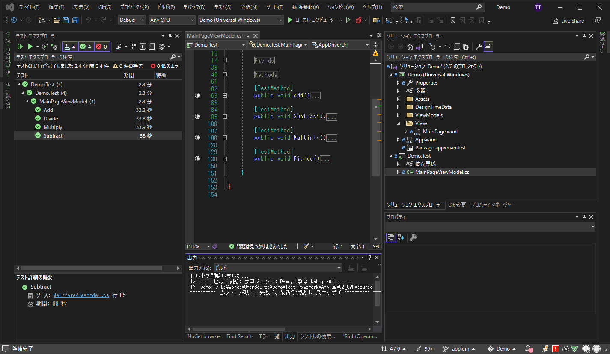

# UI Automation Test for Universal Windows Platform

## Abstacts

* How to use Appium and Windows App Driver

## Requirements

* Visual Studio 2022
* Windows App Driver

## Dependencies

* [Prism.Unity](https://github.com/PrismLibrary/Prism)
  * MIT license
    * Use legacy version 6.3.0

### For Test Only

* [Appium.WebDriver](https://github.com/appium/appium-dotnet-driver)
  * Apache-2.0 license
* [Windows App Driver](https://github.com/microsoft/WinAppDriver)
  * MIT license

## How to usage?

1. Open indows App Driver with listen address and port

````bat
C:\WINDOWS\system32>"C:\Program Files (x86)\Windows Application Driver\WinAppDriver.exe" localhost 4724
````

2. Modify code to run test if need

````csharp
    [TestClass]
    public sealed class MainPageViewModel
    {

        #region Fields

        private const string AppDriverUrl = "http://localhost:4724";
        
        private const string DemoAppId = @"Demo_zz8mjkem88v5c!App";
````

3. Start Demo.Test!!

[](./images/image.webp)