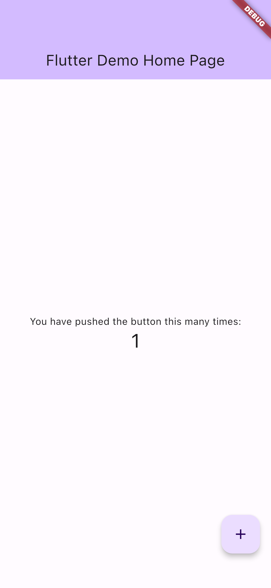

# Sample test

## Requirements

* Python

## How to use?

#### 1. bulild flutter app

|Target|Command|
|---|---|
|iPhone|`flutter build ios --profile`|
|iPhone Simulator|`flutter build ios --debug --simulator`|
|Android|flutter build apk --debug|

#### 2. Start Appium

For Windows,

````bat
$ npx appium
````

For Linux or OSX,

````sh
$ appium
````

If you saw `EADDRINUSE: address already in use 0.0.0.0:4723`, you have to change listen port number of appium.

````bat
$ npx appium -p 4725
````

#### 3. Run test

##### Precheck

You shall check proper device or simulator names.

````sh
$ flutter devices
4 connected devices:

SO 41B (mobile)        • HQ618G0E28                               • android-arm64 • Android 11 (API 30)
iPhone (2) (mobile)    • 9a1e9bf15489282f50f795bd0768752f28d62604 • ios           • iOS 15.7.8 19H364
iPhone 14 Pro (mobile) • 413F180D-9C99-4CF8-A315-0C6A8B31BB91     • ios           • com.apple.CoreSimulator.SimRuntime.iOS-16-0 (simulator)
macOS (desktop)        • macos                                    • darwin-x64    • macOS 13.2.1 22D68 darwin-x64

No wireless devices were found.
````

##### Python

At first, you should create virtual env.

For Windows,

````bat
$ cd python
$ python3 -m venv .venv
$ venv\Scripts\activate
$ python -m pip install -r requirement.txt
````

For Linux or OSX,

````sh
$ cd python
$ python3 -m venv .venv
$ source .venv/bin/activate
$ python -m pip install -r requirement.txt
````

Then, you must update python scripts.
For examples, [iphone-simulator.py](./iphone-simulator.py)

````python
driver = Remote('http://localhost:4723', dict(
    platformName='iOS',
    automationName='flutter',
    platformVersion='16.0',
    deviceName='iPhone 14 Pro',
    app='{}/../demo/build/ios/Debug-iphonesimulator/Runner.app'.format(
      os.path.dirname(os.path.realpath(__file__)))
))
````

`platformVersion` and `deviceName` should be updated.

After modfied scripts, you can run test scripts.

|Target|Command|
|---|---|
|iPhone|`python iphone-device.py`|
|iPhone Simulator|`python iphone-simulator.py`|
|Android|`python android-device.py`|
|Android Emulator|`python android-emulator.py`|

For examle or iPhone

````sh
$ % python example-simulator.py 
You have pushed the button this many times:
1
````

And you will see `screenshot-simulator.png` in current directory.

