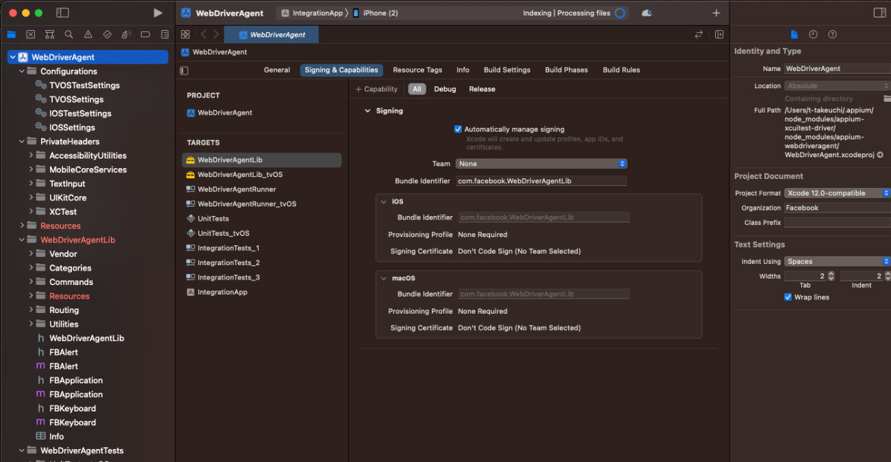

# Setup for OSX

## Requirements

* Appium 2.0 or later
* Flutter 3 or later
* npm
* Xcode 14 or later
* Apple Developper Accouont

## Setup

#### 1. Install Appium

````sh
$ npm i --location=global appium
$ appium --version
2.0.1
$ echo 'export APPIUM_HOME=$HOME/.appium' >> ~/.zprofile
````

#### 2. Install appium-doctor

````sh
$ npm i --location=global appium-doctor
$ appium-doctor
WARN AppiumDoctor [Deprecated] Please use appium-doctor installed with "npm install @appium/doctor --location=global"
info AppiumDoctor Appium Doctor v.1.16.2
info AppiumDoctor ### Diagnostic for necessary dependencies starting ###
info AppiumDoctor  ✔ The Node.js binary was found at: /usr/local/bin/node
info AppiumDoctor  ✔ Node version is 20.3.0

info AppiumDoctor  ✔ Xcode is installed at: /Applications/Xcode_14.3.app/Contents/Developer
info AppiumDoctor  ✔ Xcode Command Line Tools are installed in: /Applications/Xcode_14.3.app/Contents/Developer
WARN AppiumDoctor  ✖ DevToolsSecurity is NOT enabled!
info AppiumDoctor  ✔ The Authorization DB is set up properly.
WARN AppiumDoctor  ✖ Carthage was NOT found!
info AppiumDoctor  ✔ HOME is set to: /Users/xxxxxxx
info AppiumDoctor  ✔ ANDROID_HOME is set to: /Users/xxxxxxx/Library/Android/sdk
WARN AppiumDoctor  ✖ JAVA_HOME environment variable is NOT set!
info AppiumDoctor    Checking adb, android, emulator, apkanalyzer
info AppiumDoctor      'adb' is in /Users/xxxxxxx/Library/Android/sdk/platform-tools/adb
info AppiumDoctor      'android' is in /Users/xxxxxxx/Library/Android/sdk/tools/android
info AppiumDoctor      'emulator' is in /Users/xxxxxxx/Library/Android/sdk/emulator/emulator
info AppiumDoctor      'apkanalyzer' is in /Users/xxxxxxx/Library/Android/sdk/cmdline-tools/latest/bin/apkanalyzer
info AppiumDoctor  ✔ adb, android, emulator, apkanalyzer exist: /Users/xxxxxxx/Library/Android/sdk
WARN AppiumDoctor  ✖ Cannot check $JAVA_HOME requirements since the environment variable itself is not set
info AppiumDoctor ### Diagnostic for necessary dependencies completed, 4 fixes needed. ###
info AppiumDoctor 
info AppiumDoctor ### Diagnostic for optional dependencies starting ###
WARN AppiumDoctor  ✖ opencv4nodejs cannot be found.
info AppiumDoctor  ✔ ffmpeg is installed at: /usr/local/bin/ffmpeg. ffmpeg version 6.0 Copyright (c) 2000-2023 the FFmpeg developers
WARN AppiumDoctor  ✖ mjpeg-consumer cannot be found.
WARN AppiumDoctor  ✖ set-simulator-location is not installed
WARN AppiumDoctor  ✖ idb is not installed
WARN AppiumDoctor  ✖ applesimutils cannot be found
info AppiumDoctor  ✔ ios-deploy is installed at: /usr/local/bin/ios-deploy. Installed version is: 1.12.2
WARN AppiumDoctor  ✖ bundletool.jar cannot be found
WARN AppiumDoctor  ✖ gst-launch-1.0 and/or gst-inspect-1.0 cannot be found
info AppiumDoctor ### Diagnostic for optional dependencies completed, 7 fixes possible. ###
info AppiumDoctor 
info AppiumDoctor ### Manual Fixes Needed ###
info AppiumDoctor The configuration cannot be automatically fixed, please do the following first:
WARN AppiumDoctor  ➜ [For lower than Appium 1.20.0] Please install Carthage. Visit https://github.com/Carthage/Carthage#installing-carthage for more information.
WARN AppiumDoctor  ➜ Make sure the environment variable JAVA_HOME is properly configured for the Appium process. Refer https://github.com/appium/java-client/blob/master/docs/environment.md for more details.
WARN AppiumDoctor  ➜ Set $JAVA_HOME environment variable to the root folder path of your local JDK installation
info AppiumDoctor 
info AppiumDoctor ### Optional Manual Fixes ###
info AppiumDoctor The configuration can install optionally. Please do the following manually:
WARN AppiumDoctor  ➜ Why opencv4nodejs is needed and how to install it: http://appium.io/docs/en/writing-running-appium/image-comparison/
WARN AppiumDoctor  ➜ mjpeg-consumer module is required to use MJPEG-over-HTTP features. Please install it with 'npm i -g mjpeg-consumer'.
WARN AppiumDoctor  ➜ set-simulator-location is needed to set location for Simulator. Please read https://github.com/lyft/set-simulator-location to install it
WARN AppiumDoctor  ➜ Why idb is needed and how to install it: https://github.com/appium/appium-idb
WARN AppiumDoctor  ➜ Why applesimutils is needed and how to install it: http://appium.io/docs/en/drivers/ios-xcuitest/
WARN AppiumDoctor  ➜ bundletool.jar is used to handle Android App Bundle. Please read http://appium.io/docs/en/writing-running-appium/android/android-appbundle/ to install it
WARN AppiumDoctor  ➜ gst-launch-1.0 and gst-inspect-1.0 are used to stream the screen of the device under test. Please read https://appium.io/docs/en/writing-running-appium/android/android-screen-streaming/ to install them and for more details
info AppiumDoctor 
info AppiumDoctor ###
info AppiumDoctor 
info AppiumDoctor Bye! Run appium-doctor again when all manual fixes have been applied!
info AppiumDoctor 
xxxxxxx@TakuyanoMac-mini Appium % 
xxxxxxx@TakuyanoMac-mini Appium % appium-doctor
WARN AppiumDoctor [Deprecated] Please use appium-doctor installed with "npm install @appium/doctor --location=global"
info AppiumDoctor Appium Doctor v.1.16.2
info AppiumDoctor ### Diagnostic for necessary dependencies starting ###
info AppiumDoctor  ✔ The Node.js binary was found at: /usr/local/bin/node
info AppiumDoctor  ✔ Node version is 20.3.0
info AppiumDoctor  ✔ Xcode is installed at: /Applications/Xcode_14.3.app/Contents/Developer
info AppiumDoctor  ✔ Xcode Command Line Tools are installed in: /Applications/Xcode_14.3.app/Contents/Developer
WARN AppiumDoctor  ✖ DevToolsSecurity is NOT enabled!
info AppiumDoctor  ✔ The Authorization DB is set up properly.
WARN AppiumDoctor  ✖ Carthage was NOT found!
info AppiumDoctor  ✔ HOME is set to: /Users/xxxxxxx
info AppiumDoctor  ✔ ANDROID_HOME is set to: /Users/xxxxxxx/Library/Android/sdk
WARN AppiumDoctor  ✖ JAVA_HOME environment variable is NOT set!
info AppiumDoctor    Checking adb, android, emulator, apkanalyzer
info AppiumDoctor      'adb' is in /Users/xxxxxxx/Library/Android/sdk/platform-tools/adb
info AppiumDoctor      'android' is in /Users/xxxxxxx/Library/Android/sdk/tools/android
info AppiumDoctor      'emulator' is in /Users/xxxxxxx/Library/Android/sdk/emulator/emulator
info AppiumDoctor      'apkanalyzer' is in /Users/xxxxxxx/Library/Android/sdk/cmdline-tools/latest/bin/apkanalyzer
info AppiumDoctor  ✔ adb, android, emulator, apkanalyzer exist: /Users/xxxxxxx/Library/Android/sdk
WARN AppiumDoctor  ✖ Cannot check $JAVA_HOME requirements since the environment variable itself is not set
info AppiumDoctor ### Diagnostic for necessary dependencies completed, 4 fixes needed. ###
info AppiumDoctor 
info AppiumDoctor ### Diagnostic for optional dependencies starting ###
WARN AppiumDoctor  ✖ opencv4nodejs cannot be found.
info AppiumDoctor  ✔ ffmpeg is installed at: /usr/local/bin/ffmpeg. ffmpeg version 6.0 Copyright (c) 2000-2023 the FFmpeg developers
WARN AppiumDoctor  ✖ mjpeg-consumer cannot be found.
WARN AppiumDoctor  ✖ set-simulator-location is not installed
WARN AppiumDoctor  ✖ idb is not installed
WARN AppiumDoctor  ✖ applesimutils cannot be found
info AppiumDoctor  ✔ ios-deploy is installed at: /usr/local/bin/ios-deploy. Installed version is: 1.12.2
WARN AppiumDoctor  ✖ bundletool.jar cannot be found
WARN AppiumDoctor  ✖ gst-launch-1.0 and/or gst-inspect-1.0 cannot be found
info AppiumDoctor ### Diagnostic for optional dependencies completed, 7 fixes possible. ###
info AppiumDoctor 
info AppiumDoctor ### Manual Fixes Needed ###
info AppiumDoctor The configuration cannot be automatically fixed, please do the following first:
WARN AppiumDoctor  ➜ [For lower than Appium 1.20.0] Please install Carthage. Visit https://github.com/Carthage/Carthage#installing-carthage for more information.
WARN AppiumDoctor  ➜ Make sure the environment variable JAVA_HOME is properly configured for the Appium process. Refer https://github.com/appium/java-client/blob/master/docs/environment.md for more details.
WARN AppiumDoctor  ➜ Set $JAVA_HOME environment variable to the root folder path of your local JDK installation
info AppiumDoctor 
info AppiumDoctor ### Optional Manual Fixes ###
info AppiumDoctor The configuration can install optionally. Please do the following manually:
WARN AppiumDoctor  ➜ Why opencv4nodejs is needed and how to install it: http://appium.io/docs/en/writing-running-appium/image-comparison/
WARN AppiumDoctor  ➜ mjpeg-consumer module is required to use MJPEG-over-HTTP features. Please install it with 'npm i -g mjpeg-consumer'.
WARN AppiumDoctor  ➜ set-simulator-location is needed to set location for Simulator. Please read https://github.com/lyft/set-simulator-location to install it
WARN AppiumDoctor  ➜ Why idb is needed and how to install it: https://github.com/appium/appium-idb
WARN AppiumDoctor  ➜ Why applesimutils is needed and how to install it: http://appium.io/docs/en/drivers/ios-xcuitest/
WARN AppiumDoctor  ➜ bundletool.jar is used to handle Android App Bundle. Please read http://appium.io/docs/en/writing-running-appium/android/android-appbundle/ to install it
WARN AppiumDoctor  ➜ gst-launch-1.0 and gst-inspect-1.0 are used to stream the screen of the device under test. Please read https://appium.io/docs/en/writing-running-appium/android/android-screen-streaming/ to install them and for more details
info AppiumDoctor 
info AppiumDoctor ###
info AppiumDoctor 
info AppiumDoctor Bye! Run appium-doctor again when all manual fixes have been applied!
info AppiumDoctor 
````

#### 3. Set JAVA_HOME

Skip this setion if `JAVA_HOME` environmental value is already defined.

````sh
$ echo "export JAVA_HOME=\`/usr/libexec/java_home -v 1.8\`" >> ~/.zprofile
$ echo 'export PATH=$JAVA_HOME/bin:$PATH' >> ~/.zprofile
$ source ~/.zprofile 
$ java -version 
openjdk version "1.8.0_302"
OpenJDK Runtime Environment (Temurin)(build 1.8.0_302-b08)
OpenJDK 64-Bit Server VM (Temurin)(build 25.302-b08, mixed mode)
````

#### 4. Install flutter driver

````sh
$ appium driver install --source=npm appium-flutter-driver
✔ Installing 'appium-flutter-driver'
ℹ Driver flutter@1.19.1 successfully installed
- automationName: Flutter
- platformNames: ["iOS","Android"]
````

:warning: You need not to install `appium-xcuitest-driver`

#### 5. Config WebDriverAgent

For iOS, appium must communication with [WebDriverAgent](https://appium.github.io/appium-xcuitest-driver/4.16/wda-custom-server/).
As you known, iOS app shall be signed by proper certicates.
Therefore, we have to configure WebDriverAgent.

* Open `$APPIUM_HOME/node_modules/appium-flutter-driver/node_modules/appium-xcuitest-driver/node_modules/appium-webdriveragent/WebDriverAgent.xcodeproj` by Xcode
* Select `WebDriverAgentLib`, `WebDriverAgentRunner` and `IntegrationApp`
  * Update `Team` and `Bundle Identifier` in `Sigining & Capbilities` tab
    * e.g. `jp.taktak.appium.webdriveragentlib`, `jp.taktak.appium.webdriveragentrunner` or `jp.taktak.appium.integrationapp`



* Select `WebDriverAgentRunner` and taget real device
* `Product` -> `Test`
  * You will see the following screen in target device


## bulild flutter app

````sh
$ cd demo
$ flutter build ios --debug [---simulator]
````

## run test

### setup python

````sh
$ cd python
$ python3 -m venv .venv
$ source .venv/bin/activate
$ python -m pip install -r requirement.txt
````

### start appium on other console

````sh
$ appium --base-path=/wd/hub 
````

````sh
$ cd python
$ python example.exe
````

script install application and WebDriverAgent to device