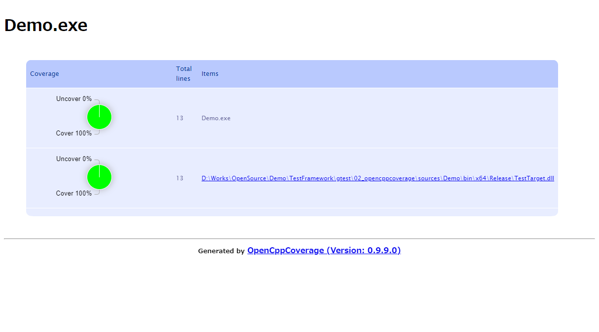
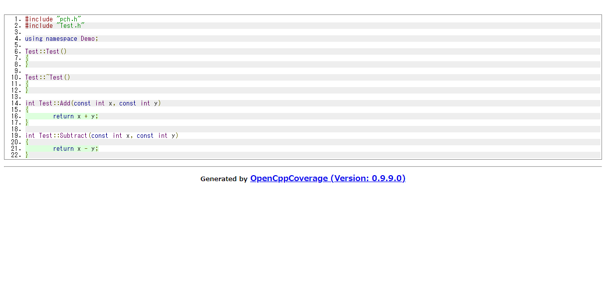

# googletest with OpenCppCoverage for Visual Studio C++

## Abstracts

* How to use googletest from source code
* Test dynamic link library
* Get code coverage

## Requirements

* Visual Studio 2022
* CMake version 3.10 or newer
  * You can install it via `winget install -e --id Kitware.CMake`

## Dependencies

* [googletest](https://github.com/google/googletest)
  * BSD-3-Clause license

### For Test Only

* [OpenCppCoverage](https://github.com/OpenCppCoverage/OpenCppCoverage)
  * GPL-3.0 license

## How to usage?

At first, you must install [OpenCppCoverage](https://github.com/OpenCppCoverage/OpenCppCoverage).

And then, You execute `Build.ps1` to build dependencies and demo program.<br>
This script builds all project and you need not to launch Visual Studio.

````cmd
$ OpenCppCoverage --sources sources\TestTarget sources\Demo\bin\x64\Release\Demo.exe
[info] Start Program:
Path:"sources\\Demo\\bin\\x64\\Release\\Demo.exe"
Arguments:
Working directory: not set.
Modules: Selected: * Excluded:
Sources: Selected: sources\TestTarget Excluded:
Log Level: Normal
Cover Children: 0
Aggregate by file: 1
Continue after C++ exception: 0
Optimized build support: 0
Export: html
Input coverage:
Unified diff:
Excluded line regular expressions:
Substitute pdb source paths:
[info] Module: D:\Works\OpenSource\Demo\TestFramework\gtest\02_opencppcoverage\sources\Demo\bin\x64\Release\Demo.exe is selected because it matches selected pattern: *
[info] Module: C:\Windows\System32\ntdll.dll is selected because it matches selected pattern: *
[info] Module: C:\Windows\System32\kernel32.dll is selected because it matches selected pattern: *
[info] Module: C:\Windows\System32\KernelBase.dll is selected because it matches selected pattern: *
[info] Module: C:\Windows\System32\ucrtbase.dll is selected because it matches selected pattern: *
[info] Module: D:\Works\OpenSource\Demo\TestFramework\gtest\02_opencppcoverage\sources\Demo\bin\x64\Release\TestTarget.dll is selected because it matches selected pattern: *
[info] Module: C:\Windows\System32\vcruntime140_1.dll is selected because it matches selected pattern: *
[info] Module: D:\Works\OpenSource\Demo\TestFramework\gtest\02_opencppcoverage\sources\Demo\bin\x64\Release\gmock.dll is selected because it matches selected pattern: *
[info] Module: C:\Windows\System32\msvcp140.dll is selected because it matches selected pattern: *
[info] Module: C:\Windows\System32\vcruntime140.dll is selected because it matches selected pattern: *
[==========] Running 2 tests from 1 test suite.
[----------] Global test environment set-up.
[----------] 2 tests from TestTarget
[ RUN      ] TestTarget.CalcAdd
[       OK ] TestTarget.CalcAdd (0 ms)
[ RUN      ] TestTarget.CalcSubtract
[       OK ] TestTarget.CalcSubtract (0 ms)
[----------] 2 tests from TestTarget (4 ms total)

[----------] Global test environment tear-down
[==========] 2 tests from 1 test suite ran. (5 ms total)
[  PASSED  ] 2 tests.
[info] Module: C:\Windows\System32\kernel.appcore.dll is selected because it matches selected pattern: *
[info] Module: C:\Windows\System32\msvcrt.dll is selected because it matches selected pattern: *
[info] Module: C:\Windows\System32\rpcrt4.dll is selected because it matches selected pattern: *
[info] ----------------------------------------------------
[info] Coverage generated in Folder D:\Works\OpenSource\Demo\TestFramework\gtest\02_opencppcoverage\CoverageReport-2022-06-29-00h47m23s
[info] ----------------------------------------------------
[info] The code coverage report is not what you expect? See the FAQ https://github.com/OpenCppCoverage/OpenCppCoverage/wiki/FAQ.
````

[](./images/image01.png)

[](./images/image02.png)