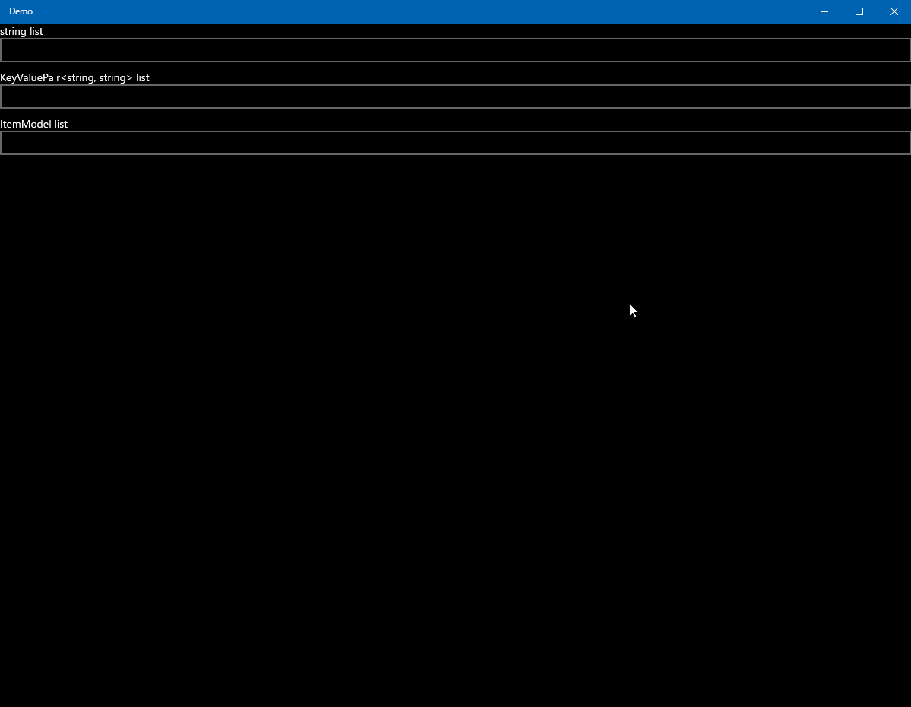

# AutoSuggestBox

* Sample usage of [Windows.UI.Xaml.Controls.AutoSuggestBox](https://learn.microsoft.com/en-us/uwp/api/windows.ui.xaml.controls.autosuggestbox)
  * This control has a strong habit

## Requirements

* Visual Studio 2022

## Dependencies

* [Microsoft.NETCore.UniversalWindowsPlatform](https://github.com/microsoft/dotnet/tree/master/releases/UWP)
  * Microsoft Software License
  * 6.2.10
* [Microsoft.Xaml.Behaviors.Uwp.Managed](https://github.com/Microsoft/XamlBehaviors)
  * MIT License
  * .0.0
* [Prism.Unity](https://prismlibrary.com/)
  * MIT License
  * 6.3.0

## Notes

* You cannot set both [Windows.UI.Xaml.Controls.AutoSuggestBox.DisplayMemberPath](https://learn.microsoft.com/en-us/windows/windows-app-sdk/api/winrt/microsoft.ui.xaml.controls.itemscontrol.displaymemberpath) and [Windows.UI.Xaml.Controls.AutoSuggestBox.ItemTemplate](https://learn.microsoft.com/en-us/windows/windows-app-sdk/api/winrt/microsoft.ui.xaml.controls.itemscontrol.itemtemplate) at the same time. If you do, an exception is thrown at runtime.
  * But this behavior is not mentioned in documents.

## Screenshots

