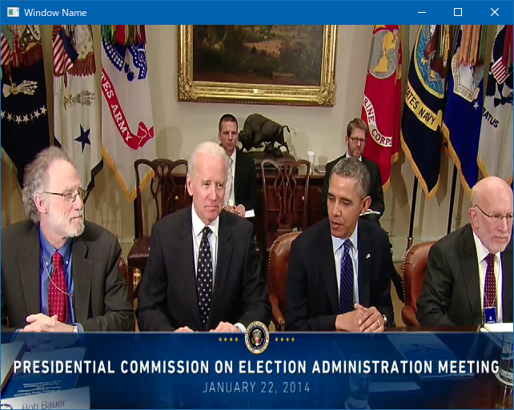

# Use virtual camera by pyvirtualcam

## Abstracts

* How to use `pyvirtualcam` on windows

## Requirements

* Python 3 or later
* [OBS Studio](https://github.com/obsproject/obs-studio)
  * GPL-2.0 license

## Dependencies

* [colorlog](https://github.com/borntyping/python-colorlog)
  * MIT license
* [opencv-python](https://github.com/opencv/opencv-python)
  * MIT license
* [pathlib](https://pypi.org/project/pathlib/)
  * MIT license
* [pyvirtualcam](https://github.com/letmaik/pyvirtualcam)
  * GPL-2.0 license
* [PyYAML](https://github.com/yaml/pyyaml.org)
  * MIT license

#### Test Data

* [Remarks by the President Before Meeting with the Presidential Commission on Election Administration](https://obamawhitehouse.archives.gov/photos-and-video/video/2014/01/22/president-obama-meets-presidential-commission-election-administrat)
  * Public domain

## How to use?

At first, you must install OBS Studio.
You can install from installer or zip package.
If you use zip package, you must deploy into `C:\Program Files\obs-studio` and kick `C:\Program Files\obs-studio\data\obs-plugins\win-dshow\virtualcam-install.bat` in commad prompt with privilege.

#### server

[server.py](./server.py) is simple program sends frame data from video or image files.

````cmd
$ python -m venv .venv
$ .venv\Scripts\activate
$ python -m pip install pyvirtualcam opencv-python colorlog pathlib pyyaml
````

You can input movie file.

````cmd
$ python server.py --source testdata\012214_ElectionAdministration_HD.mp4 --loop
2024-02-11 01:31:51,469 [INFO] Arguments
2024-02-11 01:31:51,469 [INFO]  source: testdata\012214_ElectionAdministration_HD.mp4
2024-02-11 01:31:51,469 [INFO]    loop: True
2024-02-11 01:31:51,495 [INFO] Using virtual camera: OBS Virtual Camera
2024-02-11 01:31:51,507 [INFO] sending frame
2024-02-11 01:31:51,557 [INFO] read next movie frame
2024-02-11 01:31:51,557 [INFO] sending frame
2024-02-11 01:31:51,588 [INFO] read next movie frame
2024-02-11 01:31:51,588 [INFO] sending frame
2024-02-11 01:31:51,620 [INFO] read next movie frame
...
````

Or input image files by passing directory path.

````cmd
$ python server.py --source testdata\images --loop
2024-02-11 01:31:28,523 [INFO] Arguments
2024-02-11 01:31:28,523 [INFO]  source: testdata\images
2024-02-11 01:31:28,523 [INFO]    loop: True
2024-02-11 01:31:28,538 [INFO] read testdata\images\001.jpg
2024-02-11 01:31:28,538 [INFO] Using virtual camera: OBS Virtual Camera
2024-02-11 01:31:28,555 [INFO] sending frame
2024-02-11 01:31:28,588 [INFO] read testdata\images\002.jpg
2024-02-11 01:31:28,588 [INFO] sending frame
2024-02-11 01:31:28,644 [INFO] read testdata\images\003.jpg
...
````

#### receiver

[receiver.py](./receiver.py) is simple program receive frame data from server.py.
You can specify camera index.

````cmd
$ python receiver.py --source 1
2024-02-11 02:50:38,693 [INFO] Arguments
2024-02-11 02:50:38,694 [INFO]  source: 1
2024-02-11 02:50:39,197 [INFO] press enter key to stop program
...
````

