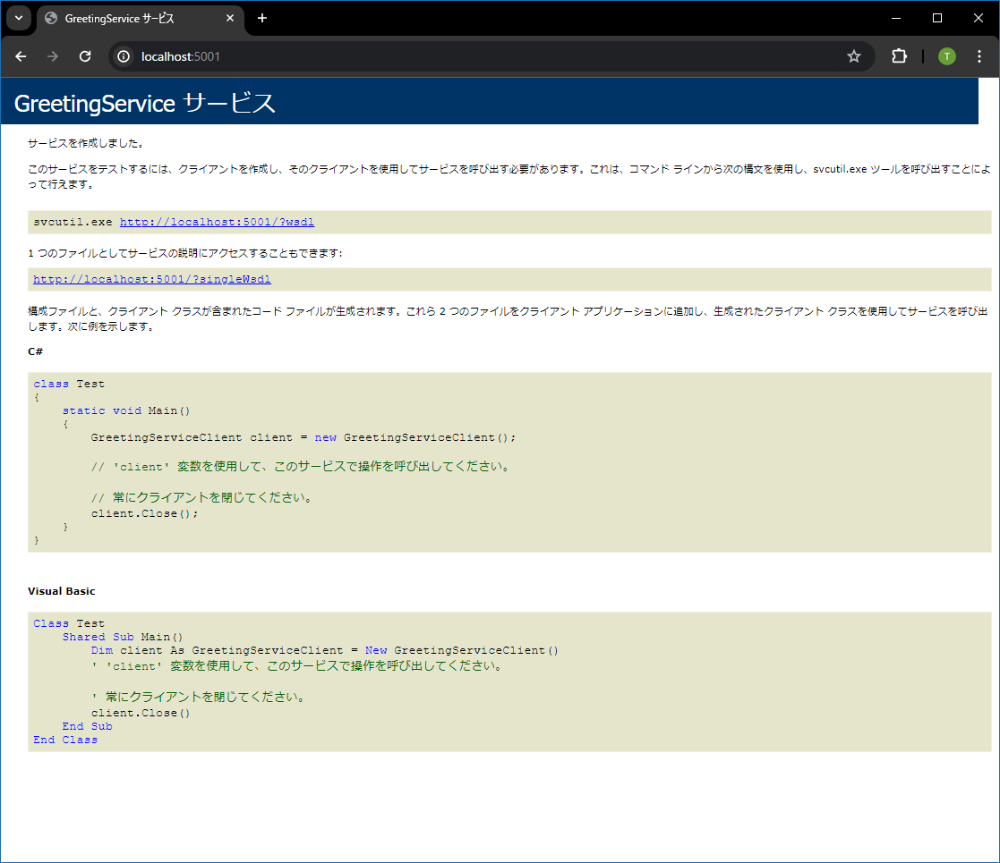
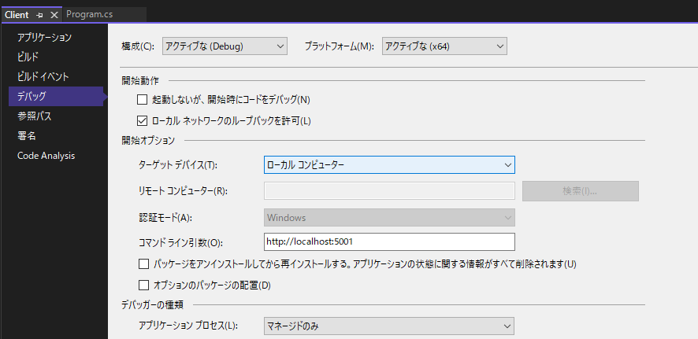
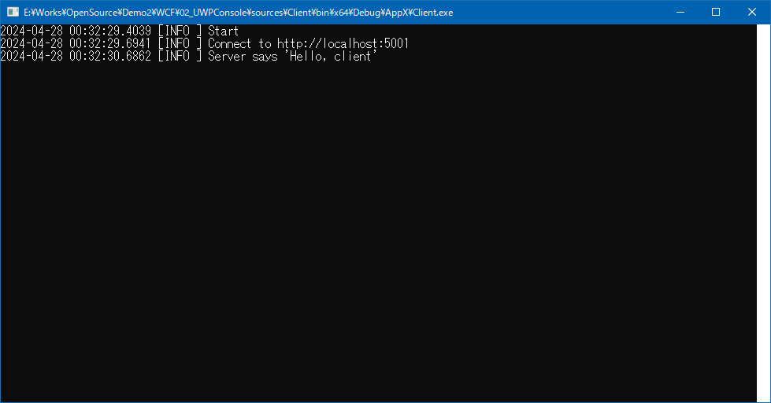

# WCF Console sample (UWP Client app and .NET Framework Server)

## Abstracts

* .NET Framework's server and UWP client apps
  * No use `*.exe.config` to config server

## Requirements

* Visual Studio 2019 or later
* .NET Framework 4.8 SDK

## Dependencies

* [NLog](https://github.com/NLog/NLog)
  * 5.0.0
  * BSD-3-Clause License

### Miscellaneous

* [Console App (Universal) Project Templates](https://marketplace.visualstudio.com/items?itemName=AndrewWhitechapelMSFT.ConsoleAppUniversal)
  * For creating UWP console app project on Visual Studio 2017 or 2019 but you need not to install it.

## How to try?

Build by `Visual Studio`.
Then, launch `Server.exe` with privilege at first.
Or execute `netsh http add urlacl url=http://+:5001/ user=everyone` with privilege.

````bat
$ cd sources\Server\bin\Debug
$ Server.exe http://localhost:5001
2024-04-27 21:15:38.0161 [INFO ] Start on http://localhost:5001 
2024-04-27 21:15:38.5078 [INFO ] The service is ready at 0 
2024-04-27 21:15:38.5128 [INFO ] Press <Enter> to stop the service.
````

You can also see service description by browser.



At last, launch `Client.exe` by `Visual Studio` debugger with command line argument.



And you can see


