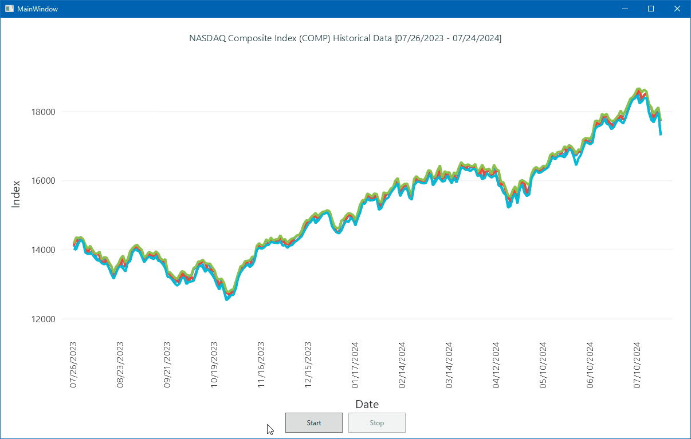

# Sync timer and thumb region of line chart

## Abstracts

* Move thumb region area according to `Tick` event

## Requirements

* Visual Studio 2022
* .NET 6.0

## Dependencies

* [LiveChartsCore.SkiaSharpView.WPF](https://github.com/beto-rodriguez/LiveCharts2)
  * 2.0.0-rc2
  * MIT License
* [Microsoft.Xaml.Behaviors.Wpf](https://github.com/Microsoft/XamlBehaviorsWpf)
  * 1.1.122
  * MIT License
* [NLog](https://github.com/NLog/NLog)
  * 5.3.2
  * BSD-3-Clause License
* [Prism.Wpf](https://github.com/PrismLibrary/Prism)
  * 8.1.97
  * MIT License
* [Prism.Unity](https://github.com/PrismLibrary/Prism)
  * 8.1.97
  * MIT License

#### Miscellaneous

* Chart data
  * [NASDAQ Composite Index (COMP) Historical Data](https://www.nasdaq.com/market-activity/index/comp/historical?page=1&rows_per_page=10&timeline=y1)

## Screenshots

