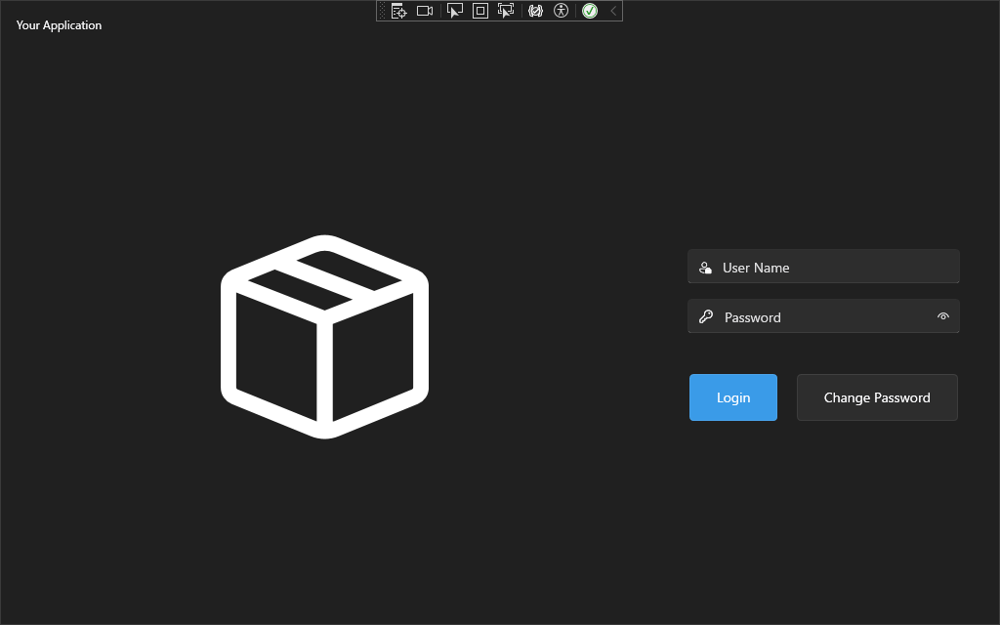

# WindowsFormsHost

## Abstracts

* How to embed `System.Windows.Forms` control into WPF
  * .NET Framework and .NET control

## Requirements

* Visual Studio 2022
* .NET 8.0

## Dependencies

* [NLog](https://github.com/NLog/NLog)
  * BSD-3-Clause License

## Screenshots

