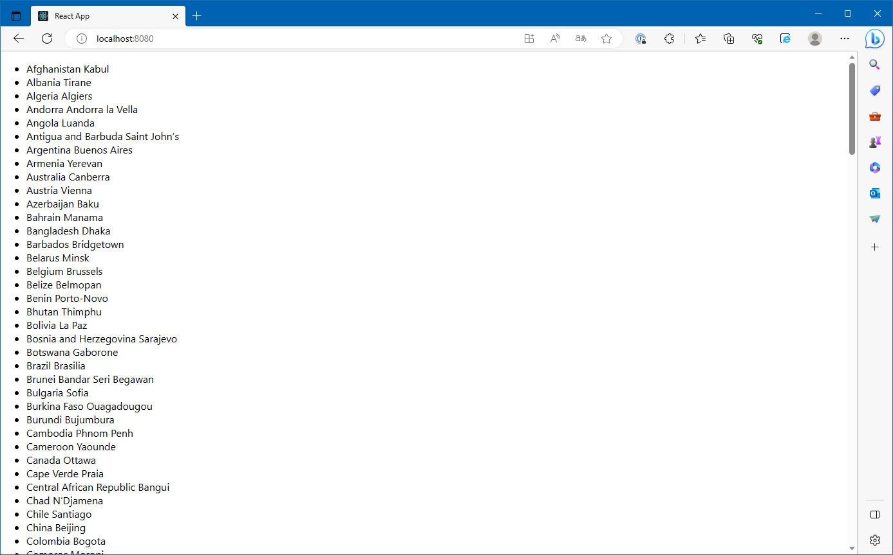

# Enumerate Countries

## Abstracts

* Load country information from json file
* Use components `Countries` and `Country`
* Deploy app to nginx by docker

## Requirements

* React
  * 18.2.0

## How to usage?

````cmd
$ npm install
````

Then, run app on local server

````cmd
$ npm start
````


## How to bundle?

````cmd
$ npm run build 
````

## How to deploy?

Here is usage of nginx by docker.
You must bundle before deploy.

````cmd
$ docker build -t react-demo .
$ docker run --rm -d -p 8080:80 react-demo
````

