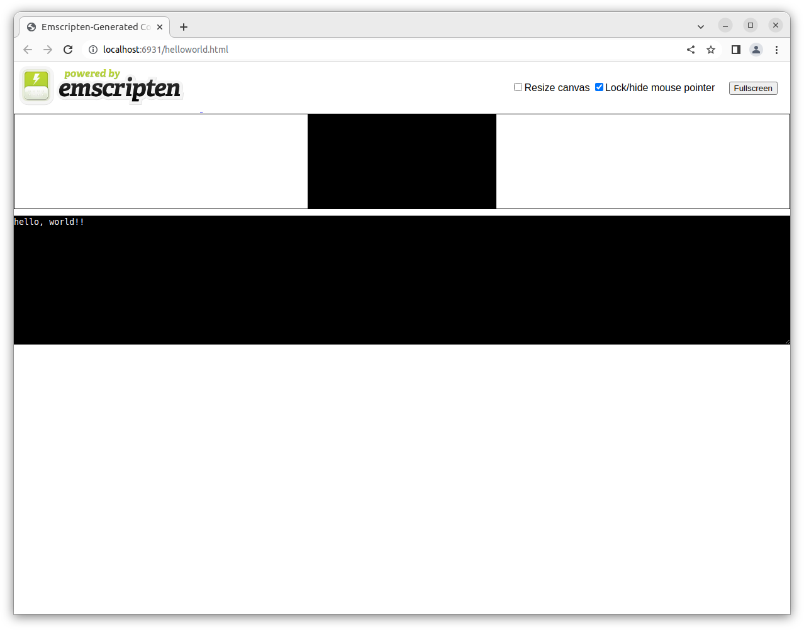
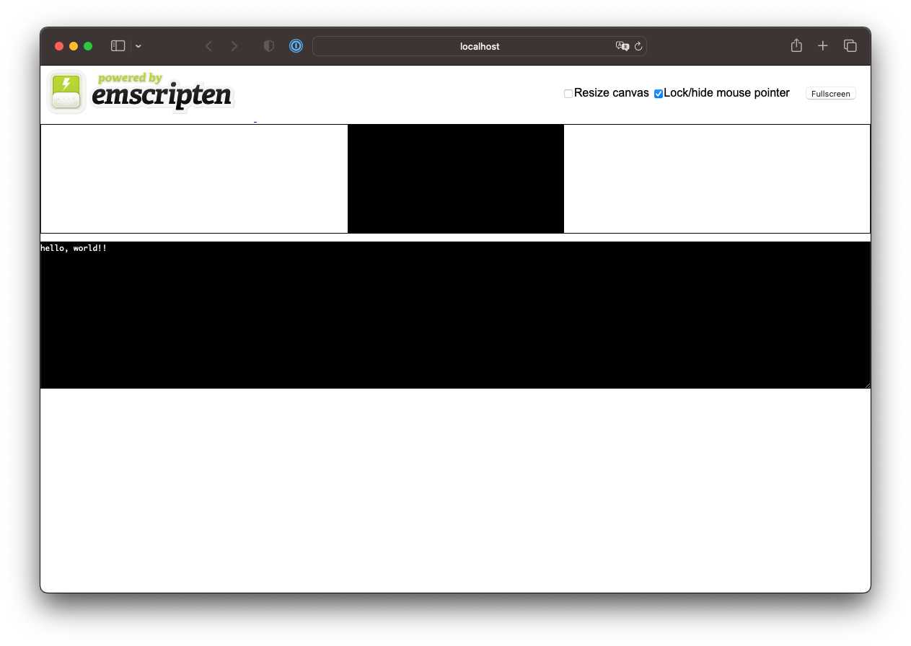

# Hello world

## Requirements

### Common

* Powershell 7 or later
* CMake 3.14.0 or later
* Google Chrome

### Windows

* [Emscripten SDK](../emsdk)
  * MIT and Expat Licence
* [ninja](https://github.com/ninja-build)
  * Apache-2.0 Licence

## How to use?

### Windows

Install `Emscripten SDK` and add location `ninja` to `Path` envrionmental variable.

### Linux

Install `Emscripten SDK`.

## How to build?

````bat
$ pwsh build.ps1 <Release/Debug>
````

## How to run?

At first, you must login to GUI shell.
Then, 

````sh
$ pwsh run.ps1 <chrome/firefox/iexplore/safari>
````

You can pass browse name you prefer.
You can check available browser names by `emrun --list_browsers`.

### Linux



### OSX


