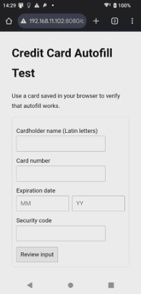

# Credit Card Number Auto Fill Test

## Abstracts

* Check web browser function to input credit card number by auto fill
  * Especially, this demo focus on iOS and Android

## Requirements

* docker

## Dependencies

* [nginx](https://github.com/nginx/nginx)
  * 1.26.1
  * BSD 2-Clause License

## How to use?

````bash
$ sudo docker compose up --build -d
````

#### HTTPS

|iOS (Safari)|Android (Chrome)|
|---|---|
|||

#### HTTP

|iOS (Safari)|Android (Chrome)|
|---|---|
|||