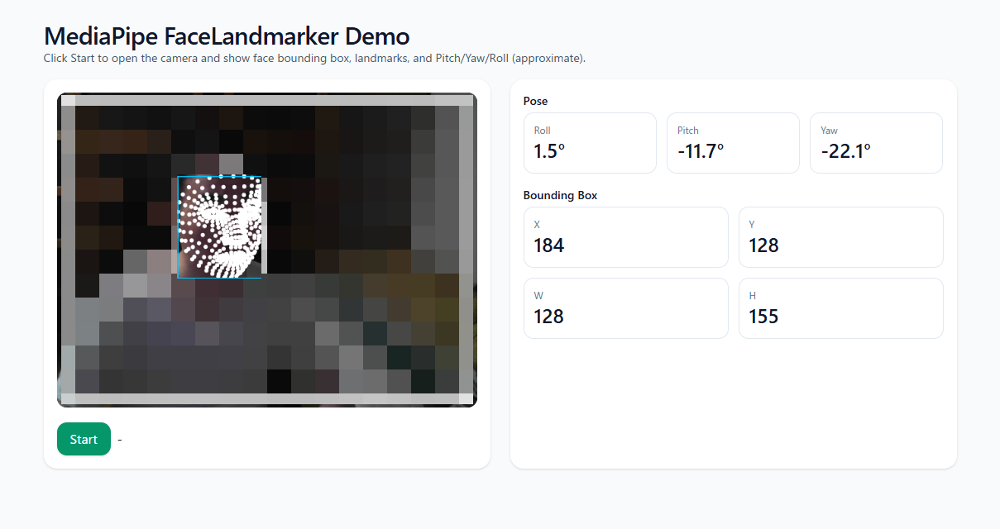

# Face Angle Check

## Abstracts

* Show face pose (Roll/Yaw/Pitch) and face landmark

## Requirements

* docker

## Dependencies

* [nginx](https://github.com/nginx/nginx)
  * 1.26.1
  * BSD 2-Clause License
* [@mediapipe/tasks-vision](https://www.npmjs.com/package/@mediapipe/tasks-vision)
  * 0.10.21
  * Apache 2.0 License

## Data

* [face_landmarker.task](./html/models/face_landmarker.task)
  * https://storage.googleapis.com/mediapipe-models/face_landmarker/face_landmarker/float16/1/face_landmarker.task

## How to use?

````bash
$ sudo docker compose up --build -d
````

|