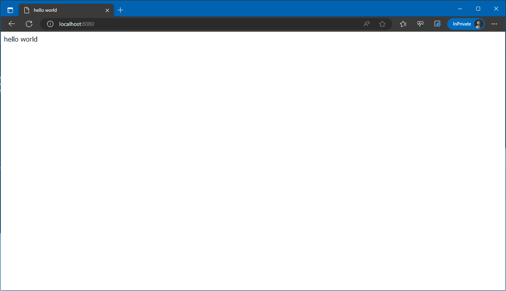

# Redirect

## Abstracts

* Redirect to https://www.google.com if user access to http://localhost:8080/redirect/xxx

## Requirements

* docker
* Powershell 7

## How to usage?

````cmd
$ BuildAndRun.ps1
````

Then, open browser and access http://localhost:8080.
You can see **hello world**

Next, access to http://localhost:8080/redirect/test, you can see google web site.

