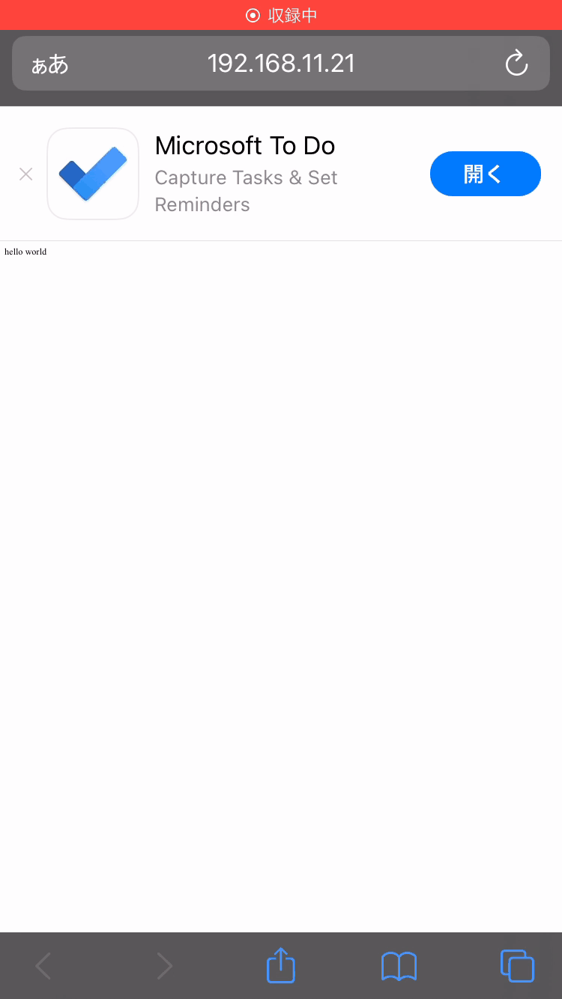

# Smart App Banner

## Abstracts

* Show Smart App Banner in Safari browser
  * You must use iOS or OSX Device because iOS simulator does not show it.
    * [Promoting Apps with Smart App Banners](https://developer.apple.com/documentation/webkit/promoting_apps_with_smart_app_banners)

## Requirements

* docker
* Powershell 7

## How to usage?

````cmd
$ BuildAndRun.ps1
````

Then, open browser and access http://localhost:8080 from iOS device.
You can see **hello world** and Smart App Banner.

